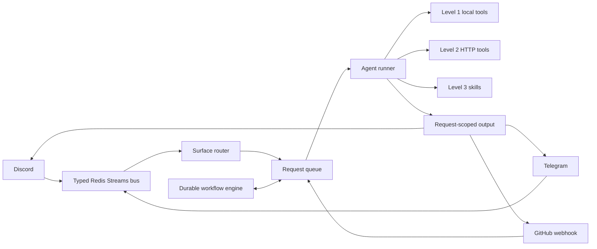
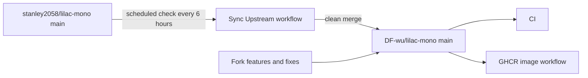

# Lilac Mono

<p align="center">
  <strong>面向 Discord、Telegram、GitHub 與本機終端的事件驅動 AI Agent Runtime</strong>
</p>

<p align="center">
  <a href="https://github.com/DF-wu/lilac-mono/actions/workflows/ci.yml"></a>
  <a href="https://github.com/stanley2058/lilac-mono"></a>
  <a href="./package.json"></a>
  <a href="./LICENSE"></a>
</p>

<p align="center">
  <a href="#選擇執行方式">選擇執行方式</a> ·
  <a href="#本-fork-的主要差異">Fork 差異</a> ·
  <a href="#快速開始">快速開始</a> ·
  <a href="#core-surfaces">Surfaces</a> ·
  <a href="./docs/README.md">完整文件</a> ·
  <a href="./PROJECT.md">架構細節</a>
</p>

> [!IMPORTANT]
> 這是以 Git history 與 `upstream` remote 持續追蹤 [`stanley2058/lilac-mono`](https://github.com/stanley2058/lilac-mono) 的 downstream fork，不是上游官方發行版。本專案定期合併上游更新，同時維護 Telegram、相容式圖像路由、GitHub 回覆連結與部署自動化等獨立功能。

Lilac 把平台訊息、路由、模型執行、工具、Skills 與可恢復工作流程放在同一套 runtime 中。Monorepo 內同時提供完整的 **Core** 服務，以及不需要 Redis 的本機 coding agent **Mini Lilac**。

## 選擇執行方式

| | Core | Mini Lilac |
| --- | --- | --- |
| 適合情境 | 長駐 bot、多平台協作、自動化與 durable workflows | 在本機專案中使用互動式 coding agent |
| 入口 | Discord、Telegram、GitHub webhook、HTTP tool server | Terminal TUI、HTTP/SSE API |
| 狀態儲存 | Redis Streams + SQLite + `DATA_DIR` | SQLite + `$XDG_STATE_HOME/mini-lilac` |
| 主要依賴 | Bun、Redis；建議使用 Docker Compose | Bun 與系統 `flock`，不需要 Redis |
| 開始方式 | 從本 repo 設定並啟動 Core | 從本 repo build 並直接執行 Mini Lilac |

Mini Lilac 是上游持續發展的產品，本 fork 會隨上游同步。若你要部署聊天平台 bot 或工作流程服務，選 Core；若只要在終端操作本機專案，Mini Lilac 是較短的路徑。

## 本 Fork 的主要差異

以下只列出目前仍與上游不同的行為。完整依據、限制與已回饋上游的項目見 [`docs/fork-differences.md`](./docs/fork-differences.md)。

| 領域 | 本 fork 提供的差異 | 重要限制 |
| --- | --- | --- |
| Telegram surface | DMs、群組、forum topics、串流 HTML 回覆、取消、reaction、command menu、outbound attachments、workflow cards 與同 surface tools | 預設停用；沒有 inbound attachment bytes；僅 long polling |
| OpenAI-compatible 圖像路由 | 將既有 `generate.image` aliases 統一路由到 operator 指定的 OpenAI-compatible endpoint | 僅 `configVersion: 2`；無自動 fallback 或自訂 alias mapping |
| GitHub 回覆 UX | `In reply to` 可直接連到 issue/PR body 或指定 comment 的 canonical permalink | GitHub comment self-loop 防護已被上游接收，不再列為 fork-only |
| Custom media plugin | 可部署的 Level 2 image/video plugin 範例，示範嚴格設定與檔案安全處理 | Plugin 是 trusted in-process code；restricted caller 目前不能使用 external callables |
| 維運與交付 | 每 6 小時檢查 upstream、GHCR `catalina`/`claudia` tags、ACP detached-run 強化 | 自動合併發生衝突時仍需人工處理 |

## 架構概覽

### Core request flow



Core 的平台 adapter 會把事件送入 typed bus。Router 建立或更新 request，agent runner 再使用模型、工具與 Skills 執行，最後由 output relay 將結果送回原 surface。GitHub webhook 可直接建立 request。

Durable workflow engine 使用相同 request bus，並以 SQLite journal 保存 trigger、wait、sleep、subagent 與恢復資訊。完整 topic、queue mode、權限與啟停順序見 [`PROJECT.md`](./PROJECT.md)。

### Fork maintenance flow



## 快速開始

### Mini Lilac：本機 coding agent

Mini Lilac 是最短的互動式使用路徑。套件目前尚未發布到 public npm registry，請從 checkout build 並直接執行；Server 預設只監聽 `127.0.0.1:8090`，TUI 必須在真正的 terminal 中執行。

```bash
git clone https://github.com/DF-wu/lilac-mono.git
cd lilac-mono
bun install --frozen-lockfile
cd apps/mini-lilac
bun run build

./dist/main.js server init
./dist/main.js server auth codex
./dist/main.js server
```

在另一個 terminal 中，進入要操作的專案：

```bash
cd /path/to/your/project
/path/to/lilac-mono/apps/mini-lilac/dist/main.js
```

確認 server：

```bash
curl -fsS http://127.0.0.1:8090/api/mini-lilac/healthz
```

設定檔、provider、API key、Codex OAuth、遠端 listener 認證與 TUI 操作見 [`apps/mini-lilac/README.md`](./apps/mini-lilac/README.md) 與 [`apps/mini-lilac-server/README.md`](./apps/mini-lilac-server/README.md)。

### Core：Docker Compose

需求：Docker Compose、Bun 1.3.14、有效的 `DISCORD_TOKEN`，以及至少一組符合 `models.main` 設定的 model provider credential。目前 Core 啟動時仍會連線 Discord；即使只使用 Telegram、GitHub 或 tool server，Discord token 仍是必要設定。各 surface 的 allowlist 依然採 fail-closed 設計。

```bash
git clone https://github.com/DF-wu/lilac-mono.git
cd lilac-mono
bun install

cp .env.example .env
chmod 600 .env
mkdir -p data
cp packages/utils/config-templates/core-config.example.yaml data/core-config.yaml

cat > compose.override.yaml <<'YAML'
services:
  lilac:
    env_file:
      - .env
YAML
```

啟動前請完成兩件事：

1. 在 `.env` 設定 `DISCORD_TOKEN` 與 `data/core-config.yaml` 所選 model provider 的 credential。Stock `compose.yaml` 不會傳入 provider credentials；上面的 `compose.override.yaml` 透過 `env_file` 明確傳入 `.env`。
2. 在 `data/core-config.yaml` 設定 Discord allowlist，並啟用與限制其他要使用的 surface。

```bash
docker compose up -d --build --wait --wait-timeout 120
bun run docker:verify
docker compose ps
curl -fsS http://localhost:8080/readyz
```

`compose.yaml` 同時啟動 Redis，並把 `./data` 掛載到 `/data`。正式部署、operator token、UID、持久化與診斷方式見 [`docs/docker-deployment.md`](./docs/docker-deployment.md)。

> [!WARNING]
> Core tool server 沒有一般用途的 public HTTP authentication。請將 `8080` 保留在可信任的主機或網路邊界，不要直接暴露到公網。

### Core：從 source 執行

先安裝 dependencies 並準備可連線的 Redis：

```bash
bun install
docker run --rm -d --name lilac-source-redis -p 127.0.0.1:6380:6379 redis:7-alpine

export REDIS_URL=redis://127.0.0.1:6380
export DATA_DIR="$PWD/data"
export LL_TOOL_SERVER_PORT=8080
bun apps/core/src/runtime/main.ts
```

Core 必須有 `REDIS_URL`、`DISCORD_TOKEN` 與有效的 model 設定。Telegram 與 GitHub 可以不啟用，但目前 Discord adapter 仍會在 Core 啟動時連線；Discord allowlist 可以保持空白以忽略所有 Discord traffic。

## Core Surfaces

| Surface | 最低設定 | 預設保護 | 詳細文件 |
| --- | --- | --- | --- |
| Discord | `DISCORD_TOKEN`；設定 `allowedChannelIds` 或 `allowedGuildIds` | 兩個 allowlist 都空時忽略所有 Discord traffic | [`core-config.example.yaml`](./packages/utils/config-templates/core-config.example.yaml) |
| Telegram | `configVersion: 2`、`enabled: true`、`TELEGRAM_BOT_TOKEN`、`allowedChatIds` | 預設停用；空 chat allowlist 時忽略所有 chats | [`docs/telegram-surface.md`](./docs/telegram-surface.md) |
| GitHub | GitHub App auth、`GITHUB_WEBHOOK_SECRET`、可被 GitHub 連到的 HTTPS/reverse proxy；user token 是可選的 preferred outbound identity | 沒有 GitHub App secret 時整個 surface 不啟動；signature 不符回傳 `401` | [`docs/github-reply-permalinks.md`](./docs/github-reply-permalinks.md) |

GitHub webhook 預設監聽 port `8787`、path `/github/webhook`。Stock Compose 沒有轉送或公開 GitHub webhook 的環境與 port，因此 production deployment 必須自行補上 reverse proxy、environment 與 network wiring。

Webhook secret 只驗證 inbound request；目前 runtime 以 GitHub App secret 作為整個 surface 的啟用條件。先設定 App，再視需要加入 user token 作為 preferred outbound identity。可用 operator-only onboarding 查看兩者參數：

```bash
docker compose exec -T lilac /usr/local/bin/tools --operator --help onboarding.github_app
docker compose exec -T lilac /usr/local/bin/tools --operator --help onboarding.github_user_token
```

Telegram 支援完整對話路徑、workflow cards 與同 surface tools，但平台能力不等於 Discord。Inbound media、history、reaction 與 search 差異請以 [`Telegram feature status`](./docs/telegram-surface.md#10-what-works-and-what-does-not) 為準。

## 工具、Skills 與工作流程

Core 將 agent 能力分成三層：

1. **Level 1**：`bash`、檔案讀寫、search、patch、batch、subagent delegation 等 run-local tools。
2. **Level 2**：由 HTTP tool server 提供的 web、surface、workflow、MCP、attachments、generation、SSH 等 callables。
3. **Level 3**：從磁碟探索、按需載入的 `SKILL.md` bundles。

建立並使用 `tools` CLI：

```bash
cd apps/tool-bridge
bun run build
./dist/index.js --list
./dist/index.js --help workflow.run.list
```

連到其他 backend：

```bash
TOOL_SERVER_BACKEND_URL=http://host:8080 ./apps/tool-bridge/dist/index.js --list
```

外部 plugins 放在 `DATA_DIR/plugins/<plugin-id>/`。它們與 Core 在同一 process 中執行，具有 Core process 的權限；開發前請閱讀 [`PLUGIN_AUTHORING.md`](./PLUGIN_AUTHORING.md)。

## Fork 專屬用法

### 啟用 Telegram

```yaml
configVersion: 2

surface:
  telegram:
    enabled: true
    tokenEnv: TELEGRAM_BOT_TOKEN
    allowedChatIds:
      - "1001"
```

在 `.env` 設定 token，避免把 credential 留在 shell history：

```dotenv
TELEGRAM_BOT_TOKEN=replace-with-botfather-token
```

```bash
docker compose up -d --wait --wait-timeout 120
curl -s localhost:8080/readyz | jq '.checks[] | select(.name == "telegram.ready")'
```

群組 privacy mode、forum topic session IDs、streaming、command menu 與 troubleshooting 見 [`docs/telegram-surface.md`](./docs/telegram-surface.md)。

### 路由圖像生成到相容 endpoint

```yaml
configVersion: 2

tools:
  generate:
    image:
      provider: openai-compatible
```

Docker Compose 請把 endpoint 與 credential 寫入已由 `compose.override.yaml` 載入的 `.env`：

```dotenv
OPENAI_COMPATIBLE_BASE_URL=https://provider.example.com/v1
OPENAI_COMPATIBLE_API_KEY=replace-with-api-key
```

然後重建 container：

```bash
docker compose up -d --force-recreate --wait --wait-timeout 120 lilac
```

從 source 執行時，改為 `export` 同名變數後再啟動 Core。

Alias、generation/edit endpoints、無 fallback 行為與 `aspectRatio` 限制見 [`docs/generate-image-openai-compatible.md`](./docs/generate-image-openai-compatible.md)。

### 使用 custom-media plugin 範例

```bash
mkdir -p data/plugins
cp -R examples/plugins/custom-media data/plugins/custom-media
docker compose restart lilac
docker compose up -d --wait --wait-timeout 120 lilac
docker compose exec -T lilac /usr/local/bin/tools --operator --list
docker compose exec -T lilac /usr/local/bin/tools --operator --help custom-media.image
```

完整 build、credential、model 與 file-safety contract 見 [`examples/plugins/custom-media/README.md`](./examples/plugins/custom-media/README.md)。

## Operator CLI

`lilac-acp` 可探索本機 ACP harness、搜尋或 snapshot sessions，並以 detached worker 執行 prompt。支援的 harness 取決於本機安裝與 discovery 結果。

```bash
cd apps/acp-controller
bun run build
./dist/index.js harnesses list
./dist/index.js sessions list --directory /path/to/repo --search "failing tests"
./dist/index.js prompt submit --directory /path/to/repo --harness opencode --text "Fix the failing tests"
```

狀態與取消命令見 [`apps/acp-controller/README.md`](./apps/acp-controller/README.md)。

## Repository Map

| Path | Purpose |
| --- | --- |
| `apps/core/` | Redis-backed Core runtime 與所有 surface、workflow、tool wiring |
| `apps/mini-lilac/` | 可安裝的 unified Mini Lilac command |
| `apps/mini-lilac-server/` | Redis-free HTTP/SSE coding-agent server |
| `apps/mini-lilac-tui/` | OpenTUI terminal client |
| `apps/tool-bridge/` | `tools` CLI 與 standalone tool-server entrypoint |
| `apps/acp-controller/` | `lilac-acp` multi-harness controller |
| `packages/event-bus/` | Typed Redis Streams contract 與 transport |
| `packages/agent/` | AI SDK streaming、steering、follow-up 與 interrupt control |
| `packages/plugin-runtime/` | Level 1/Level 2 plugin contract |
| `packages/mini-lilac-runtime/` | Mini sessions、transcripts、providers 與 tools |
| `packages/mini-lilac-client/` | Mini wire protocol 與 reconnectable transport |
| `packages/utils/` | Config、providers、prompts 與 Skills |
| `data/` | Core 的 local runtime state；不要提交 secrets |
| `ref/` | Vendored/reference repositories；依各自 license，視為 read-only |

## 開發與驗證

本 repo 使用 Bun workspaces：

```bash
bun install
bun run ci
```

`bun run ci` 會依序檢查 codegen、lint、root/workspace tests、TypeScript 與 formatting。常用的個別命令：

```bash
bun run test:all
bun run typecheck
bun run lint
bun run fmt:check
```

各 workspace 的 build、test 與 typecheck 命令見 [`AGENTS.md`](./AGENTS.md)；專案名詞與完整架構見 [`PROJECT.md`](./PROJECT.md)。

## Upstream 同步與支援邊界

`.github/workflows/sync-upstream.yml` 每 6 小時檢查一次 upstream `main`，有新 commits 時嘗試 merge 到本 fork 的 `main`。乾淨合併後會觸發 image build；發生 conflict 時由維護者人工處理。

- 本 fork 新功能、部署 workflow、Telegram 或相容式圖像路由問題：請在 [`DF-wu/lilac-mono`](https://github.com/DF-wu/lilac-mono/issues) 回報。
- 可在未修改 upstream 重現的問題：先確認 upstream 狀態，再向 [`stanley2058/lilac-mono`](https://github.com/stanley2058/lilac-mono/issues) 回報。
- 歷史上由本 fork 回饋並已被 upstream 接收的功能，不再列為當前差異。清單見 [`docs/fork-differences.md`](./docs/fork-differences.md#已被上游接收的貢獻)。

## 文件

從 [`docs/README.md`](./docs/README.md) 開始查找部署、surface、fork 功能與 extension 文件。

## License 與致謝

本 repository 依 [MIT License](./LICENSE) 發布，保留上游原作者的 copyright 與授權文字。

感謝 [`stanley2058/lilac-mono`](https://github.com/stanley2058/lilac-mono) 的原始設計與持續開發。本 fork 與上游維護者沒有從屬或官方背書關係。

`ref/` 內的 vendored/reference material 各自適用其原始授權條款。
