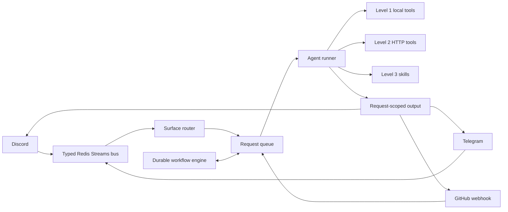
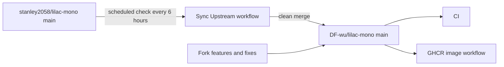

# Lilac Mono

<p align="center">
  <strong>Event-driven AI Agent Runtime for Discord, Telegram, GitHub, and the local terminal</strong>
</p>

<p align="center">
  <a href="https://github.com/DF-wu/lilac-mono/actions/workflows/ci.yml"></a>
  <a href="https://github.com/stanley2058/lilac-mono"></a>
  <a href="./package.json"></a>
  <a href="./LICENSE"></a>
</p>

<p align="center">
  <strong>Language:</strong> <a href="./README.md">English (primary / canonical)</a> · <a href="./README.zh-TW.md">繁體中文 (translation)</a>
</p>

<p align="center">
  <a href="#choose-your-runtime">Choose your runtime</a> ·
  <a href="#fork-differences">Fork differences</a> ·
  <a href="#quick-start">Quick start</a> ·
  <a href="#core-surfaces">Surfaces</a> ·
  <a href="./docs/README.md">Full documentation</a> ·
  <a href="./PROJECT.md">Architecture details</a>
</p>

> [!IMPORTANT]
> This is a downstream fork that continuously tracks [`stanley2058/lilac-mono`](https://github.com/stanley2058/lilac-mono) through Git history and the `upstream` remote. It is not an official upstream release. This project regularly merges upstream updates while maintaining independent Telegram, OpenAI-compatible image routing, GitHub reply permalink, and deployment automation features.

Lilac brings platform messaging, routing, model execution, tools, Skills, and recoverable workflows into one runtime. The monorepo provides both the full **Core** service and **Mini Lilac**, a local coding agent that does not require Redis.

## Choose Your Runtime

| | Core | Mini Lilac |
| --- | --- | --- |
| Best for | Long-running bots, multi-platform collaboration, automation, and durable workflows | Using an interactive coding agent in a local project |
| Entry points | Discord, Telegram, GitHub webhook, HTTP tool server | Terminal TUI, HTTP/SSE API |
| State | Redis Streams + SQLite + `DATA_DIR` | SQLite + `$XDG_STATE_HOME/mini-lilac` |
| Main dependencies | Bun, Redis; Docker Compose is recommended | Bun and system `flock`; Redis is not required |
| Getting started | Configure and start Core from this repo | Build and run Mini Lilac directly from this repo |

Mini Lilac is a product under active upstream development, and this fork syncs with upstream. Choose Core to deploy a chat-platform bot or workflow service; choose Mini Lilac for the shortest path to operating a local project from the terminal.

## Fork Differences

The table below lists only behavior that still differs from upstream. For the full rationale, limitations, and items reported back upstream, see [`docs/fork-differences.md`](./docs/fork-differences.md).

| Area | Difference provided by this fork | Important limitations |
| --- | --- | --- |
| Telegram surface | DMs, groups, forum topics, streaming HTML replies, cancellation, reactions, command menu, outbound attachments, workflow cards, and same-surface tools | Disabled by default; inbound attachment bytes are unavailable; long polling only |
| OpenAI-compatible image routing | Routes the existing `generate.image` aliases through a single operator-specified OpenAI-compatible endpoint | `configVersion: 2` only; no automatic fallback or custom alias mapping |
| GitHub reply UX | `In reply to` can link directly to an issue/PR body or a specified comment's canonical permalink | GitHub comment self-loop protection has been accepted upstream and is no longer fork-only |
| Custom media plugin | Deployable Level 2 image/video plugin example demonstrating strict configuration and file-safety handling | The plugin is trusted in-process code; restricted callers currently cannot use external callables |
| Operations and delivery | Upstream checks every 6 hours, GHCR `catalina`/`claudia` tags, and ACP detached-run hardening | Automatic merges still require manual handling when conflicts occur |

## Architecture Overview

### Core request flow



Core platform adapters send events to the typed bus. The router creates or updates a request, and the agent runner executes it using models, tools, and Skills. The output relay then sends the result back to the originating surface. GitHub webhooks can create requests directly.

The durable workflow engine uses the same request bus and stores trigger, wait, sleep, subagent, and recovery information in a SQLite journal. See [`PROJECT.md`](./PROJECT.md) for the complete topics, queue modes, permissions, and startup/shutdown order.

### Fork maintenance flow



## Quick Start

### Mini Lilac: Local Coding Agent

Mini Lilac is the shortest path to interactive use. The package is not currently published to the public npm registry, so build it from a checkout and run it directly. The server listens on `127.0.0.1:8090` by default, and the TUI must run in a real terminal.

```bash
git clone https://github.com/DF-wu/lilac-mono.git
cd lilac-mono
bun install --frozen-lockfile
cd apps/mini-lilac
bun run build

./dist/main.js server init
./dist/main.js server auth codex
./dist/main.js server
```

In another terminal, enter the project you want to operate on:

```bash
cd /path/to/your/project
/path/to/lilac-mono/apps/mini-lilac/dist/main.js
```

Check the server:

```bash
curl -fsS http://127.0.0.1:8090/api/mini-lilac/healthz
```

See [`apps/mini-lilac/README.md`](./apps/mini-lilac/README.md) and [`apps/mini-lilac-server/README.md`](./apps/mini-lilac-server/README.md) for configuration, providers, API keys, Codex OAuth, remote listener authentication, and TUI usage.

### Core: Docker Compose

Requirements: Docker Compose, Bun 1.3.14, a valid `DISCORD_TOKEN`, and at least one model provider credential matching the `models.main` configuration. Core still connects to Discord at startup; the Discord token remains required even when using only Telegram, GitHub, or the tool server. All surface allowlists remain fail-closed.

```bash
git clone https://github.com/DF-wu/lilac-mono.git
cd lilac-mono
bun install

cp .env.example .env
chmod 600 .env
mkdir -p data
cp packages/utils/config-templates/core-config.example.yaml data/core-config.yaml

cat > compose.override.yaml <<'YAML'
services:
  lilac:
    env_file:
      - .env
YAML
```

Before starting, complete these two steps:

1. Set `DISCORD_TOKEN` and the credential for the model provider selected in `data/core-config.yaml` in `.env`. Stock `compose.yaml` does not pass provider credentials; the `compose.override.yaml` above explicitly passes `.env` through `env_file`.
2. Configure the Discord allowlist in `data/core-config.yaml`, and enable and restrict any other surfaces you plan to use.

```bash
docker compose up -d --build --wait --wait-timeout 120
bun run docker:verify
docker compose ps
curl -fsS http://localhost:8080/readyz
```

`compose.yaml` also starts Redis and mounts `./data` at `/data`. See [`docs/docker-deployment.md`](./docs/docker-deployment.md) for production deployment, operator tokens, UID, persistence, and diagnostics.

> [!WARNING]
> Core's tool server has no general-purpose public HTTP authentication. Keep `8080` on a trusted host or network boundary; do not expose it directly to the public internet.

### Core: Run from Source

Install the dependencies and prepare a reachable Redis instance:

```bash
bun install
docker run --rm -d --name lilac-source-redis -p 127.0.0.1:6380:6379 redis:7-alpine

export REDIS_URL=redis://127.0.0.1:6380
export DATA_DIR="$PWD/data"
export LL_TOOL_SERVER_PORT=8080
bun apps/core/src/runtime/main.ts
```

Core requires `REDIS_URL`, `DISCORD_TOKEN`, and a valid model configuration. Telegram and GitHub may remain disabled, but the Discord adapter still connects when Core starts; leave the Discord allowlist empty to ignore all Discord traffic.

## Core Surfaces

| Surface | Minimum configuration | Default protection | Documentation |
| --- | --- | --- | --- |
| Discord | `DISCORD_TOKEN`; configure `allowedChannelIds` or `allowedGuildIds` | Ignores all Discord traffic when both allowlists are empty | [`core-config.example.yaml`](./packages/utils/config-templates/core-config.example.yaml) |
| Telegram | `configVersion: 2`, `enabled: true`, `TELEGRAM_BOT_TOKEN`, `allowedChatIds` | Disabled by default; ignores all chats when the chat allowlist is empty | [`docs/telegram-surface.md`](./docs/telegram-surface.md) |
| GitHub | GitHub App auth, `GITHUB_WEBHOOK_SECRET`, and an HTTPS/reverse proxy reachable by GitHub; a user token is an optional preferred outbound identity | The surface does not start without the GitHub App secret; returns `401` for an invalid signature | [`docs/github-reply-permalinks.md`](./docs/github-reply-permalinks.md) |

The GitHub webhook listens on port `8787` and path `/github/webhook` by default. Stock Compose does not forward or expose the GitHub webhook environment and port, so production deployments must provide the reverse proxy, environment, and network wiring themselves.

The webhook secret only verifies inbound requests; the runtime currently uses the GitHub App secret as the condition for enabling the entire surface. Set up the App first, then add a user token as the preferred outbound identity if needed. Use operator-only onboarding to inspect both parameters:

```bash
docker compose exec -T lilac /usr/local/bin/tools --operator --help onboarding.github_app
docker compose exec -T lilac /usr/local/bin/tools --operator --help onboarding.github_user_token
```

Telegram supports the full conversation path, workflow cards, and same-surface tools, but its platform capabilities are not identical to Discord. See [`Telegram feature status`](./docs/telegram-surface.md#10-what-works-and-what-does-not) for differences in inbound media, history, reactions, and search.

## Tools, Skills, and Workflows

Core divides agent capabilities into three levels:

1. **Level 1**: Run-local tools such as `bash`, file I/O, search, patch, batch, and subagent delegation.
2. **Level 2**: Callables provided by the HTTP tool server, including web, surface, workflow, MCP, attachments, generation, and SSH.
3. **Level 3**: `SKILL.md` bundles discovered on disk and loaded on demand.

Build and use the `tools` CLI:

```bash
cd apps/tool-bridge
bun run build
./dist/index.js --list
./dist/index.js --help workflow.run.list
```

Connect to another backend:

```bash
TOOL_SERVER_BACKEND_URL=http://host:8080 ./apps/tool-bridge/dist/index.js --list
```

External plugins go in `DATA_DIR/plugins/<plugin-id>/`. They run in the same process as Core and have the Core process's permissions; read [`PLUGIN_AUTHORING.md`](./PLUGIN_AUTHORING.md) before developing one.

## Fork-Specific Usage

### Enable Telegram

```yaml
configVersion: 2

surface:
  telegram:
    enabled: true
    tokenEnv: TELEGRAM_BOT_TOKEN
    allowedChatIds:
      - "1001"
```

Set the token in `.env` to avoid leaving the credential in shell history:

```dotenv
TELEGRAM_BOT_TOKEN=replace-with-botfather-token
```

```bash
docker compose up -d --wait --wait-timeout 120
curl -s localhost:8080/readyz | jq '.checks[] | select(.name == "telegram.ready")'
```

See [`docs/telegram-surface.md`](./docs/telegram-surface.md) for group privacy mode, forum topic session IDs, streaming, the command menu, and troubleshooting.

### Route Image Generation to a Compatible Endpoint

```yaml
configVersion: 2

tools:
  generate:
    image:
      provider: openai-compatible
```

For Docker Compose, put the endpoint and credential in `.env`, which is loaded by `compose.override.yaml`:

```dotenv
OPENAI_COMPATIBLE_BASE_URL=https://provider.example.com/v1
OPENAI_COMPATIBLE_API_KEY=replace-with-api-key
```

Then recreate the container:

```bash
docker compose up -d --force-recreate --wait --wait-timeout 120 lilac
```

When running from source, export the variables with the same names before starting Core.

See [`docs/generate-image-openai-compatible.md`](./docs/generate-image-openai-compatible.md) for aliases, generation/edit endpoints, the absence of fallback behavior, and `aspectRatio` limitations.

### Use the Custom Media Plugin Example

```bash
mkdir -p data/plugins
cp -R examples/plugins/custom-media data/plugins/custom-media
docker compose restart lilac
docker compose up -d --wait --wait-timeout 120 lilac
docker compose exec -T lilac /usr/local/bin/tools --operator --list
docker compose exec -T lilac /usr/local/bin/tools --operator --help custom-media.image
```

See [`examples/plugins/custom-media/README.md`](./examples/plugins/custom-media/README.md) for the complete build, credential, model, and file-safety contract.

## Operator CLI

`lilac-acp` discovers local ACP harnesses, searches or snapshots sessions, and runs prompts through detached workers. Supported harnesses depend on local installation and discovery results.

```bash
cd apps/acp-controller
bun run build
./dist/index.js harnesses list
./dist/index.js sessions list --directory /path/to/repo --search "failing tests"
./dist/index.js prompt submit --directory /path/to/repo --harness opencode --text "Fix the failing tests"
```

See [`apps/acp-controller/README.md`](./apps/acp-controller/README.md) for status and cancellation commands.

## Repository Map

| Path | Purpose |
| --- | --- |
| `apps/core/` | Redis-backed Core runtime and all surface, workflow, and tool wiring |
| `apps/mini-lilac/` | Installable unified Mini Lilac command |
| `apps/mini-lilac-server/` | Redis-free HTTP/SSE coding-agent server |
| `apps/mini-lilac-tui/` | OpenTUI terminal client |
| `apps/tool-bridge/` | `tools` CLI and standalone tool-server entrypoint |
| `apps/acp-controller/` | `lilac-acp` multi-harness controller |
| `packages/event-bus/` | Typed Redis Streams contract and transport |
| `packages/agent/` | AI SDK streaming, steering, follow-up, and interrupt control |
| `packages/plugin-runtime/` | Level 1/Level 2 plugin contract |
| `packages/mini-lilac-runtime/` | Mini sessions, transcripts, providers, and tools |
| `packages/mini-lilac-client/` | Mini wire protocol and reconnectable transport |
| `packages/utils/` | Config, providers, prompts, and Skills |
| `data/` | Core local runtime state; do not commit secrets |
| `ref/` | Vendored/reference repositories; subject to their respective licenses and treated as read-only |

## Development and Verification

This repo uses Bun workspaces:

```bash
bun install
bun run ci
```

`bun run ci` checks codegen, lint, root/workspace tests, TypeScript, and formatting in sequence. Common individual commands:

```bash
bun run test:all
bun run typecheck
bun run lint
bun run fmt:check
```

See [`AGENTS.md`](./AGENTS.md) for each workspace's build, test, and typecheck commands; see [`PROJECT.md`](./PROJECT.md) for project terminology and the complete architecture.

## Upstream Sync and Support Boundaries

`.github/workflows/sync-upstream.yml` checks upstream `main` every 6 hours and attempts to merge new commits into this fork's `main`. A clean merge triggers an image build; maintainers handle conflicts manually.

- Report new fork features, deployment workflows, Telegram issues, or OpenAI-compatible image-routing issues in [`DF-wu/lilac-mono`](https://github.com/DF-wu/lilac-mono/issues).
- For an issue reproducible without fork modifications, first confirm the upstream state, then report it to [`stanley2058/lilac-mono`](https://github.com/stanley2058/lilac-mono/issues).
- Features historically contributed by this fork and accepted upstream are no longer listed as current differences. See [`docs/fork-differences.md`](./docs/fork-differences.md#accepted-upstream-contributions) for the list.

## Documentation

Start with [`docs/README.md`](./docs/README.md) to find deployment, surface, fork-feature, and extension documentation.

## License and Acknowledgements

This repository is released under the [MIT License](./LICENSE), retaining the original upstream authors' copyright and license text.

Thanks to [`stanley2058/lilac-mono`](https://github.com/stanley2058/lilac-mono) for the original design and continued development. This fork has no affiliation with or official endorsement from the upstream maintainers.

Vendored/reference material in `ref/` is subject to its original license terms.
