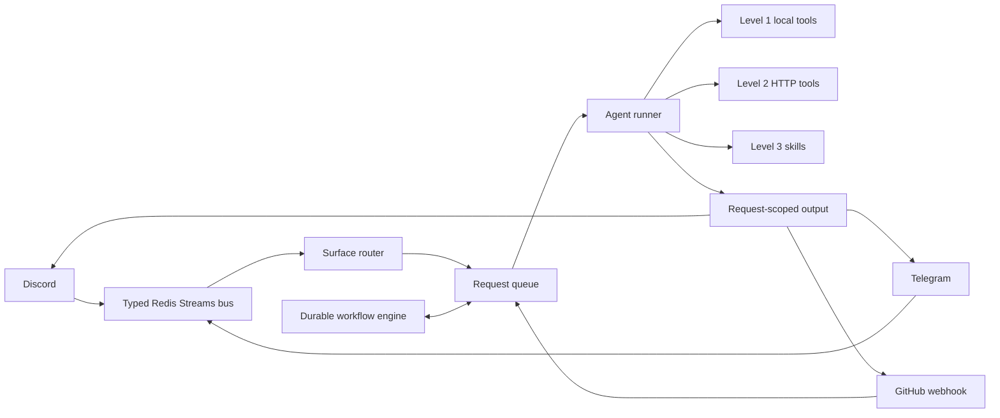
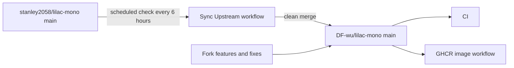

<p align="center">
  
</p>

# Lilac Mono

<p align="center">
  <strong>Event-driven AI Agent Runtime for Web, Discord, Telegram, GitHub, and the local terminal</strong>
</p>

Lilac is an AI assistant you host yourself and use from the web, a terminal, or Discord. It can work with files, run
commands, and use web tools. You choose its models and the channels where it can respond. Optional
integrations add computer use and GitHub access.

<p align="center">
  <a href="https://github.com/DF-wu/lilac-mono/actions/workflows/ci.yml"></a>
  <a href="https://github.com/stanley2058/lilac-mono"></a>
  <a href="./package.json"></a>
  <a href="./LICENSE"></a>
</p>

<p align="center">
  <strong>Language:</strong> <a href="./README.md">English (primary / canonical)</a> · <a href="./README.zh-TW.md">繁體中文 (translation)</a>
</p>

<p align="center">
  <a href="#fork-differences">Fork differences</a> ·
  <a href="#quick-start">Quick start</a> ·
  <a href="#core-surfaces">Surfaces</a> ·
  <a href="./docs/README.md">Full documentation</a> ·
  <a href="./PROJECT.md">Architecture details</a>
</p>
Lilac Core is the Redis-backed, event-driven runtime for Discord, Telegram, and optional GitHub ingress.
It owns surface routing, agent execution, output relays, durable workflows, and the internal HTTP tool
server.

Architecture and ownership are documented in [`PROJECT.md`](./PROJECT.md). Repository rules for coding agents are in [`AGENTS.md`](./AGENTS.md).

> [!IMPORTANT]
> This is a downstream fork that continuously tracks [`stanley2058/lilac-mono`](https://github.com/stanley2058/lilac-mono) through Git history and the `upstream` remote. It is not an official upstream release. This project regularly merges upstream updates while maintaining independent Telegram, OpenAI-compatible image routing, GitHub reply permalink, and deployment automation features.

Lilac brings platform messaging, routing, model execution, tools, Skills, and recoverable workflows
into one runtime.

## Fork Differences

The table below lists only behavior that still differs from upstream. For the full rationale, limitations, and items reported back upstream, see [`docs/fork-differences.md`](./docs/fork-differences.md).

| Area                            | Difference provided by this fork                                                                                                                       | Important limitations                                                                             |
| ------------------------------- | ------------------------------------------------------------------------------------------------------------------------------------------------------ | ------------------------------------------------------------------------------------------------- |
| Telegram surface                | DMs, groups, forum topics, streaming HTML replies, cancellation, reactions, command menu, inbound/outbound attachments, workflow cards, and same-surface tools | Disabled by default; long polling only                                                    |
| OpenAI-compatible image routing | Routes the existing `generate.image` aliases through a single operator-specified OpenAI-compatible endpoint                                            | `configVersion: 2` only; no automatic fallback or custom alias mapping                            |
| GitHub reply UX                 | `In reply to` can link directly to an issue/PR body or a specified comment's canonical permalink                                                       | GitHub comment self-loop protection has been accepted upstream and is no longer fork-only         |
| Custom media plugin             | Deployable Level 2 image/video plugin example demonstrating strict configuration and file-safety handling                                              | The plugin is trusted in-process code; restricted callers currently cannot use external callables |
| Operations and delivery         | Upstream checks every 6 hours and GHCR publishes verified `catalina`/`claudia` tags                                                                    | Automatic merges still require manual handling when conflicts occur                               |

## Architecture Overview

### Core request flow



Core platform adapters send events to the typed bus. The router creates or updates a request, and the agent runner executes it using models, tools, and Skills. The output relay then sends the result back to the originating surface. GitHub webhooks can create requests directly.

The durable workflow engine uses the same request bus and stores trigger, wait, sleep, subagent, and recovery information in a SQLite journal. See [`PROJECT.md`](./PROJECT.md) for the complete topics, queue modes, permissions, and startup/shutdown order.

### Fork maintenance flow



## Quick Start

### Core: Docker Compose

Requirements: Docker Compose 2.30 or newer, Bun 1.4.2, and at least one model provider credential matching the `models.main` configuration. A valid `DISCORD_TOKEN` is required only when Discord is enabled. All surface allowlists remain fail-closed.

```bash
git clone https://github.com/DF-wu/lilac-mono.git
cd lilac-mono
bun install

cp .env.example .env
chmod 600 .env
mkdir -p data
cp packages/utils/config-templates/core-config.example.yaml data/core-config.yaml

cat > compose.override.yaml <<'YAML'
services:
  lilac:
    env_file:
      - .env
YAML
```

Before starting, complete these two steps:

1. Set the credential for the model provider selected in `data/core-config.yaml` in `.env`. Also set `DISCORD_TOKEN` if Discord is enabled. Stock `compose.yaml` does not pass provider credentials; the `compose.override.yaml` above explicitly passes `.env` through `env_file`.
2. Configure the Discord allowlist in `data/core-config.yaml`, and enable and restrict any other surfaces you plan to use.

```bash
docker compose up -d --build --wait --wait-timeout 120
bun run docker:verify
docker compose ps
curl -fsS http://localhost:8080/readyz
```

`compose.yaml` also starts Redis and mounts `./data` at `/data`. See [`docs/docker-deployment.md`](./docs/docker-deployment.md) for production deployment, operator tokens, UID, persistence, and diagnostics.

For the guided installer, provider authentication, terminal-only access, and native Web sign-in, see [`docs/installation.md`](./docs/installation.md). The temporary operator TUI is available with `docker compose exec --user root lilac lilac-tui`; when native Web is enabled, open `http://localhost:8789`.

> [!WARNING]
> Core's tool server has no general-purpose public HTTP authentication. Keep `8080` on a trusted host or network boundary; do not expose it directly to the public internet.

### Core: Run from Source

Install the dependencies and prepare a reachable Redis instance:

```bash
bun install
docker run --rm -d --name lilac-source-redis -p 127.0.0.1:6380:6379 redis:7-alpine

export REDIS_URL=redis://127.0.0.1:6380
export DATA_DIR="$PWD/data"
export LL_TOOL_SERVER_PORT=8080
bun apps/core/src/runtime/main.ts
```

Core requires `REDIS_URL` and a valid model configuration. Set `DISCORD_TOKEN` when Discord is enabled; native-only deployments can start without Discord credentials.

## Core Surfaces

| Surface  | Minimum configuration                                                                                                                             | Default protection                                                                               | Documentation                                                                            |
| -------- | ------------------------------------------------------------------------------------------------------------------------------------------------- | ------------------------------------------------------------------------------------------------ | ---------------------------------------------------------------------------------------- |
| Native   | `surface.native.enabled: true`, installation ID, local or Clerk authentication, and provider credentials                                          | Disabled by default; authenticated owner access only                                             | [`docs/native-surface.md`](./docs/native-surface.md)                                     |
| Discord  | `DISCORD_TOKEN`; configure `allowedChannelIds` or `allowedGuildIds`                                                                               | Ignores all Discord traffic when both allowlists are empty                                       | [`core-config.example.yaml`](./packages/utils/config-templates/core-config.example.yaml) |
| Telegram | `configVersion: 2`, `enabled: true`, `token`, `allowedChatIds`                                                                                    | Disabled by default; ignores all chats when the chat allowlist is empty                          | [`docs/telegram-surface.md`](./docs/telegram-surface.md)                                 |
| GitHub   | GitHub App auth, `GITHUB_WEBHOOK_SECRET`, and an HTTPS/reverse proxy reachable by GitHub; a user token is an optional preferred outbound identity | The surface does not start without the GitHub App secret; returns `401` for an invalid signature | [`docs/github-reply-permalinks.md`](./docs/github-reply-permalinks.md)                   |

The GitHub webhook listens on port `8787` and path `/github/webhook` by default. Stock Compose does not forward or expose the GitHub webhook environment and port, so production deployments must provide the reverse proxy, environment, and network wiring themselves.

The webhook secret only verifies inbound requests; the runtime currently uses the GitHub App secret as the condition for enabling the entire surface. Set up the App first, then add a user token as the preferred outbound identity if needed. Use operator-only onboarding to inspect both parameters:

```bash
docker compose exec -T lilac /usr/local/bin/tools --operator --help onboarding.github_app
docker compose exec -T lilac /usr/local/bin/tools --operator --help onboarding.github_user_token
```

Telegram supports the full conversation path, workflow cards, and same-surface tools, but its platform capabilities are not identical to Discord. See [`Telegram feature status`](./docs/telegram-surface.md#10-what-works-and-what-does-not) for differences in inbound media, history, reactions, and search.

## Tools, Skills, and Workflows

Core divides agent capabilities into three levels:

1. **Level 1**: Run-local tools such as `bash`, file I/O, search, patch, batch, and subagent delegation.
2. **Level 2**: Callables provided by the HTTP tool server, including web, surface, workflow, MCP, attachments, generation, and SSH.
3. **Level 3**: `SKILL.md` bundles discovered on disk and loaded on demand.

Build and use the `tools` CLI:

```bash
cd apps/tool-bridge
bun run build
./dist/index.js --list
./dist/index.js --help workflow.run.list
```

Connect to another backend:

```bash
TOOL_SERVER_BACKEND_URL=http://host:8080 ./apps/tool-bridge/dist/index.js --list
```

External plugins go in `DATA_DIR/plugins/<plugin-id>/`. They run in the same process as Core and have the Core process's permissions; read [`PLUGIN_AUTHORING.md`](./PLUGIN_AUTHORING.md) before developing one.

## Fork-Specific Usage

### Enable Telegram

```yaml
configVersion: 2

surface:
  telegram:
    enabled: true
    token: replace-with-botfather-token
    allowedChatIds:
      - "1001"
```

Keep `data/core-config.yaml` private because it contains the bot token:

```bash
chmod 600 data/core-config.yaml
```

```bash
docker compose up -d --wait --wait-timeout 120
curl -s localhost:8080/readyz | jq '.checks[] | select(.name == "telegram.ready")'
```

See [`docs/telegram-surface.md`](./docs/telegram-surface.md) for group privacy mode, forum topic session IDs, streaming, the command menu, and troubleshooting.

### Route Image Generation to a Compatible Endpoint

```yaml
configVersion: 2

tools:
  generate:
    image:
      provider: openai-compatible
```

For Docker Compose, put the endpoint and credential in `.env`, which is loaded by `compose.override.yaml`:

```dotenv
OPENAI_COMPATIBLE_BASE_URL=https://provider.example.com/v1
OPENAI_COMPATIBLE_API_KEY=replace-with-api-key
```

Then recreate the container:

```bash
docker compose up -d --force-recreate --wait --wait-timeout 120 lilac
```

When running from source, export the variables with the same names before starting Core.

See [`docs/generate-image-openai-compatible.md`](./docs/generate-image-openai-compatible.md) for aliases, the `openaiCompatible.models` allowlist and `openaiCompatible.modelIds` overrides, generation/edit endpoints, the absence of fallback behavior, and colon-form `size` aspect-ratio forwarding.

### Use the Custom Media Plugin Example

```bash
mkdir -p data/plugins
cp -R examples/plugins/custom-media data/plugins/custom-media
docker compose restart lilac
docker compose up -d --wait --wait-timeout 120 lilac
docker compose exec -T lilac /usr/local/bin/tools --operator --list
docker compose exec -T lilac /usr/local/bin/tools --operator --help custom-media.image
```

See [`examples/plugins/custom-media/README.md`](./examples/plugins/custom-media/README.md) for the complete build, credential, model, and file-safety contract.

## Repository Map

| Path                           | Purpose                                                                                        |
| ------------------------------ | ---------------------------------------------------------------------------------------------- |
| `apps/core/`                   | Redis-backed Core runtime and all surface, workflow, and tool wiring                           |
| `apps/tool-bridge/`            | `tools` CLI and standalone tool-server entrypoint                                              |
| `apps/installer/`              | Guided Docker setup and reconfiguration CLI                                                    |
| `apps/computer-use-gateway/`   | Optional authenticated desktop-session gateway                                                 |
| `packages/event-bus/`          | Typed Redis Streams contract and transport                                                     |
| `packages/agent/`              | AI SDK streaming, steering, follow-up, and interrupt control                                   |
| `packages/plugin-runtime/`     | Level 1/Level 2 plugin contract                                                                |
| `packages/utils/`              | Config, providers, prompts, and Skills                                                         |
| `data/`                        | Core local runtime state; do not commit secrets                                                |
| `ref/`                         | Vendored/reference repositories; subject to their respective licenses and treated as read-only |

## Development and Verification

This repo uses Bun workspaces:

```bash
bun install
bun run ci
```

`bun run ci` checks codegen, lint, root/workspace tests, TypeScript, and formatting in sequence. Common individual commands:

```bash
bun run check
bun run ci
bun run test:core
bun run test:all
bun run typecheck
bun run lint
bun run fmt:check
```

`bun run check` runs the concurrent local repository gates; `bun run ci` runs the conservative serial CI sequence. The full suite includes the permanent architecture and production-syntax gates.

See [`AGENTS.md`](./AGENTS.md) for each workspace's build, test, and typecheck commands; see [`PROJECT.md`](./PROJECT.md) for project terminology and the complete architecture.

## Upstream Sync and Support Boundaries

`.github/workflows/sync-upstream.yml` checks upstream `main` every 6 hours and attempts to merge new commits into this fork's `main`. A clean merge triggers an image build; maintainers handle conflicts manually.

- Report new fork features, deployment workflows, Telegram issues, or OpenAI-compatible image-routing issues in [`DF-wu/lilac-mono`](https://github.com/DF-wu/lilac-mono/issues).
- For an issue reproducible without fork modifications, first confirm the upstream state, then report it to [`stanley2058/lilac-mono`](https://github.com/stanley2058/lilac-mono/issues).
- Features historically contributed by this fork and accepted upstream are no longer listed as current differences. See [`docs/fork-differences.md`](./docs/fork-differences.md#accepted-upstream-contributions) for the list.

## Documentation

- [`PROJECT.md`](./PROJECT.md): durable architecture, terminology, ownership, and where-to-change guide
- [`core-config.example.yaml`](./packages/utils/config-templates/core-config.example.yaml): current Core configuration reference
- [`docs/core-config-migrations.md`](./docs/core-config-migrations.md): manual Core config upgrades
- [`plan/README.md`](./plan/README.md): active implementation plans
- [`MIGRATIONS.md`](./MIGRATIONS.md): persisted-data, wire, and protocol migrations
- [`docs/README.md`](./docs/README.md): deployment, surface, fork-feature, and extension index
- [`docs/installation.md`](./docs/installation.md): guided installation, providers, and reconfiguration
- [`docs/docker-deployment.md`](./docs/docker-deployment.md): container deployment and diagnostics
- [`docs/native-surface.md`](./docs/native-surface.md): native Web authentication, configuration, and operation
- [`docs/computer-use.md`](./docs/computer-use.md): optional desktop gateway and runner deployment
- [`docs/claude-code.md`](./docs/claude-code.md): Claude Code authentication, tools, continuation, and storage
- [`docs/skill-authoring.md`](./docs/skill-authoring.md): skill format, discovery, and authoring guidance
- [`PLUGIN_AUTHORING.md`](./PLUGIN_AUTHORING.md): Core tool plugin contract

## License and Acknowledgements

This repository is released under the [MIT License](./LICENSE), retaining the original upstream authors' copyright and license text.

Thanks to [`stanley2058/lilac-mono`](https://github.com/stanley2058/lilac-mono) for the original design and continued development. This fork has no affiliation with or official endorsement from the upstream maintainers.

Vendored/reference material in `ref/` is subject to its original license terms.
