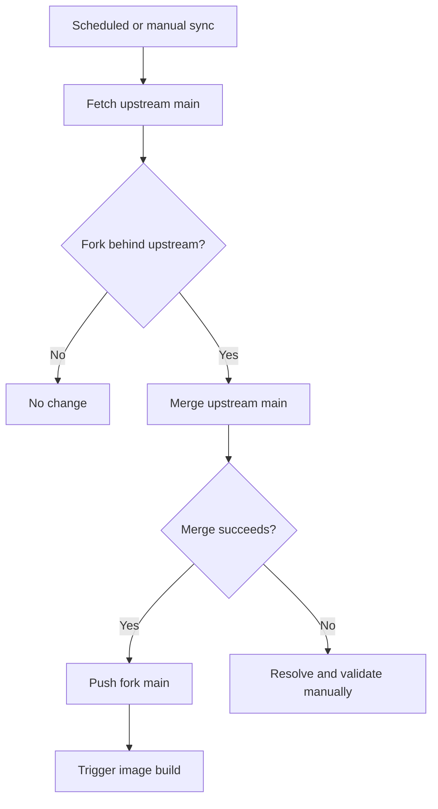

# Fork Differences

Language: [`English (primary / canonical)`](./fork-differences.md) · [`Traditional Chinese (translation)`](./fork-differences.zh-TW.md)

This document describes the current differences between [`DF-wu/lilac-mono`](https://github.com/DF-wu/lilac-mono) and [`stanley2058/lilac-mono`](https://github.com/stanley2058/lilac-mono).

The comparison baseline is the merge base with upstream `main` as of 2026-09-26: this fork includes upstream commit [`e8d6d09b`](https://github.com/stanley2058/lilac-mono/commit/e8d6d09ba112c36a163107fa0c9ac743f61d7a41) and retains the following feature and operational changes on top of it.

> [!IMPORTANT]
> This is a maintenance document, not a permanent compatibility commitment. After an upstream sync, differences that have been accepted upstream or no longer exist must be removed from this table or reclassified.

## Current Fork-only Features

| Area | Difference | Entry point | Limitations or considerations |
| --- | --- | --- | --- |
| Telegram surface | Adds DM, group, and forum topic ingress; streamed HTML output; cancellation, reactions, command menus, inbound/outbound attachments, workflow cards/actions, same-surface tools, and participation in cross-surface conversation memory (one indexed thread per chat or topic, gated by `allowedChatIds`) | [`telegram-surface.md`](./telegram-surface.md), fork PR [#45](https://github.com/DF-wu/lilac-mono/pull/45) | Disabled by default; long polling only; history comes from the local SQLite index |
| Structured `generate.image` | Upstream commit [`05115838`](https://github.com/stanley2058/lilac-mono/commit/05115838) replaced `generate.image` with a JavaScript script runner (`image-script.ts`, a `providers` global, and per-provider recipes in the `image-generation` skill). The fork keeps the structured prompt / model-alias / size / mask / `outputDir` tool, its tests, and a skill that documents that contract | [`apps/core/src/tool-server/tools/generate-image/`](../apps/core/src/tool-server/tools/generate-image/), [`generate-image-openai-compatible.md`](./generate-image-openai-compatible.md) | Upstream's script recipes are unavailable; agents cannot run arbitrary image scripts through `generate.image`. This is the largest tool-contract divergence and must be re-evaluated on every sync that touches `tools/generate.ts` |
| OpenAI-compatible image routing | Uses v2 config to route all existing `generate.image` aliases to a single operator-specified endpoint, with an optional alias allowlist and per-alias upstream model-ID overrides; ratio-driven aliases forward `aspectRatio` as a colon-form `size` | [`generate-image-openai-compatible.md`](./generate-image-openai-compatible.md), fork PR [#47](https://github.com/DF-wu/lilac-mono/pull/47) | No official-provider fallback or cross-provider retry |
| GitHub reply permalinks | `In reply to` links point to the specified issue/PR body or comment anchor | [`github-reply-permalinks.md`](./github-reply-permalinks.md), fork PR [#49](https://github.com/DF-wu/lilac-mono/pull/49) | Body targets require the issue database ID; falls back to the thread URL when unavailable |
| Custom media plugin example | Provides an external Level 2 image/video plugin using an OpenAI-compatible image API and a QuantumNous/new-api-compatible video flow | [`custom-media/README.md`](../examples/plugins/custom-media/README.md), fork PR [#30](https://github.com/DF-wu/lilac-mono/pull/30) | Plugins are trusted in-process code; restricted callers currently cannot use external callables directly |
| Compatible-provider tool calls | When a compatible provider returns a nonstandard finish reason such as `other`, parsed local tool calls are still executed and their results preserved | Commit [`1c58e532`](https://github.com/DF-wu/lilac-mono/commit/1c58e532201ee51782c98c1d8b16086f6bf45c34) | Trusts only local tool calls that passed the parser; arbitrary provider text is not treated as a tool invocation |
| Container delivery | The build workflow publishes verified `catalina`, `claudia`, and SHA tags, with `latest` pointing to `catalina`; each variant has its own account and home directory, and the image also includes `rsync` | [`build-image.yml`](../.github/workflows/build-image.yml), [`Dockerfile`](../Dockerfile) | Both published variants use UID/GID 3000; host bind mounts must grant that numeric identity access |
| Upstream maintenance | A scheduled workflow fetches upstream `main` every 6 hours, attempts a merge when new commits exist, and triggers an image build after a successful merge | [`sync-upstream.yml`](../.github/workflows/sync-upstream.yml) | Merge conflicts fail the workflow and require manual integration and validation |

## Current Telegram Status

Telegram is currently the largest fork-only product delta. The main implemented paths include:

- DMs, groups, supergroups, and forum topics.
- Mention/active routing, streamed edits, HTML rendering, and 4096-character chunking.
- Reply context, cancellation, typing indicators, reactions, custom commands, and menu aliases.
- Inbound photos/documents, outbound attachments, workflow progress/actions, `waitForReply`, and allowlist-bound surface tools.

Items that remain unimplemented or are constrained by the platform:

- Only long polling is supported; there is no webhook ingress.
- There is no Telegram-native conversation search index, inline query support, business account support, or voice/video transcription.
- Message history includes only content the bot actually observed or sent, not Telegram's complete pre-existing history.

See [`telegram-surface.md`](./telegram-surface.md#10-what-works-and-what-does-not) for the precise feature matrix and platform differences.

## Accepted Upstream Contributions

The following capabilities currently exist in this fork but no longer constitute fork divergence:

| Original contribution | Upstream status | Classification |
| --- | --- | --- |
| Configurable Exa web search provider | Upstream PR [#1](https://github.com/stanley2058/lilac-mono/pull/1) has been merged | Treated as an inherited upstream capability |
| `TAVILY_API_BASE_URL` and related normalization/docs | Upstream PRs [#4](https://github.com/stanley2058/lilac-mono/pull/4) and [#5](https://github.com/stanley2058/lilac-mono/pull/5) have been merged | Treated as an inherited upstream capability |
| GitHub agent-comment marker, safe trigger parsing, and self-trigger loop prevention | Upstream PR [#13](https://github.com/stanley2058/lilac-mono/pull/13) has been merged | Not listed as a fork-only GitHub difference |

## Items That Should Not Be Listed as Current Differences

- **Core runtime, Discord, GitHub webhook foundation, event bus, workflows, tools, and plugins**: these primarily come from upstream. The README may describe them normally, but they must not be credited to this fork.
- **Architecture Atlas**: the related workspace and functionality have been fully reverted.
- **Fork-specific Discord working-indicator defaults**: these have been restored to the upstream defaults.
- **Old empty-reply feature flag**: this has been reverted or superseded by later upstream behavior.
- **`smart-search` foundational runtime**: the relevant implementation is not currently present in the tree. It is reverted/superseded behavior, not a current container capability.

## Compatibility and Security Boundaries

This fork retains the main upstream architecture and config migration policy, but new features may require `configVersion: 2`. Greenfield changes may be breaking changes; read [`../MIGRATIONS.md`](../MIGRATIONS.md) before upgrading.

The following mechanisms are guardrails or trusted execution, not hostile-code sandboxes:

- Core and Mini Bash/filesystem checks.
- Programmatic workflow policy.
- External plugins and MCP stdio processes.
- Tool server request capabilities.
- Filesystem access between processes running under the same UID inside Docker.

For deployment, also read [`docker-deployment.md`](./docker-deployment.md) and [`../PROJECT.md`](../PROJECT.md).

## Fork Code Layout

The fork keeps behavior in fork-owned modules and touches upstream files only at thin seams: imports, one-line registrations, closed-union members, and re-exports. Anything that needs more than that is either contributed upstream or isolated behind a fork-owned entry point.

| Feature | Fork-owned modules | Upstream seams |
| --- | --- | --- |
| Telegram surface | `apps/core/src/surface/telegram/` (adapter, ingress, router, output, store, protocol). `telegram-surface-runtime.ts` is the single wiring entry Core calls: startup adapter resolution, the runtime descriptor entry, config hot-reload, and workflow target authorization | `runtime/create-core-runtime.ts` (four one-line call sites), `runtime/compose-builtin-surface-runtimes.ts` (one descriptor entry), the closed platform unions in `surface/types.ts`, `builtin-surface-protocols.ts`, `bridge/request-ids.ts`, and the workflow target types |
| Telegram conversation memory | `apps/core/src/surface/telegram/telegram-conversation-source.ts` (SQL views over `telegram-surface.db`, projection decoders, attachment metadata) and the `telegramConversationMemoryInput` / `hydrateTelegramConversationAttachments` helpers in `telegram-surface-runtime.ts` | `conversation/thread-store.ts` (a third source branch, `telegram_thread` kind, allowlist clause), `thread-service.ts` (surface labels and allowlist checks), the summarization worker protocol, `bus-agent-runner.ts` (recall surface label), `tool-server/tools/conversation-thread.ts` (enum) |
| Telegram configuration | `packages/utils/core-config/telegram-surface.ts` (type, defaults, v2 schema) and `telegram-runtime.ts` (token and database-path helpers) | `core-config/types.ts`, `v1.ts`, `v2.ts` (one field each) and `core-config.ts` re-exports |
| Structured `generate.image` | `apps/core/src/tool-server/tools/generate-image/` (`input`, `models`, `prompt`, `routing`, `callable`) | `tool-server/tools/generate.ts` (callable hook plus exported shared helpers) and `plugins/builtin/server-tools.ts` (passes core config) |
| Image routing configuration | `packages/utils/core-config/generate-image.ts` | The same config seams as above |
| Command menu aliases | `packages/utils/custom-commands-menu.ts` (alias grammar, `@target`-aware token parsing) and `apps/core/src/custom-commands/menu-aliases.ts` (deterministic alias assignment) | `custom-commands/manager.ts` (alias index and parse options) and `packages/utils/index.ts` |
| Origin-session authority | None yet; the change lives in upstream files | `tool-server/create-tool-server.ts`, `request-control-authority.ts`, `tools/surface.ts`, `tools/bash-impl.ts`, `apps/tool-bridge/client.ts`, `packages/plugin-runtime/types.ts`. This is the first candidate for an upstream contribution |
| Architecture gate | None | `scripts/architecture/manifest.ts`, `precise-exception-identities.ts`, and `core-final-boundary-identities.ts` register the fork modules |

`bun run fork:footprint` lists every upstream file that differs from the merge base with `upstream/main` and fails when one is missing from [`scripts/fork/upstream-footprint.txt`](../scripts/fork/upstream-footprint.txt), where each entry records why that seam exists. It also reports entries whose file no longer differs so the list shrinks as upstream accepts changes. CI runs it on every push and pull request.

## Branch Policy

`main` is the only long-lived branch: upstream `main` plus the fork's features, always green. Everything else is short-lived and merges into `main` through a pull request so CI (including the upstream-footprint job) runs first.

| Prefix | Use | Lifetime |
| --- | --- | --- |
| `chore/sync-upstream-YYYYMMDD` | Merging upstream `main`, conflict resolution, and any follow-up needed to keep fork features working with the new upstream | Deleted after the PR merges |
| `feat/`, `fix/`, `refactor/`, `docs/`, `test/` | One change each, named after the change (`feat/telegram-forum-topics`) | Deleted after the PR merges |
| `archive/<old-branch>` (tag, not branch) | Retired work whose commits are not in `main` but may be worth reading later | Permanent; never checked out for new work |

Rules:

- No `backup/`, `dep/`, `pr/`, or `review-*` branches. A pre-rebase safety point is a tag or a stash, and a branch that was opened as a pull request against upstream is deleted once upstream accepts or declines it.
- Delete a branch as soon as its PR merges; `git branch --merged origin/main` and `git cherry origin/main <branch>` decide whether anything unmerged remains.
- Worktrees follow the same rule: one per active branch, removed with the branch.
- Cleanup on 2026-09-26 archived 21 branches as `archive/*` tags and deleted 78 local and remote branches.

## Upstream Sync Policy



Sync principles:

1. Preserve upstream commit history by integrating with merges.
2. Fork-only features must have independent tests and documentation so their behavior does not have to be inferred from commit messages during a sync.
3. After upstream accepts equivalent functionality, compare the contracts before removing the duplicate patch and its fork-only claim from this document.
4. When conflicts occur, do not obtain a green sync by ignoring tests or directly overwriting fork behavior.
5. After every sync and every fork change, run `bun run fork:footprint`. Remove stale entries, and move new leakage into a fork-owned module before adding an entry.

## Updating This Document

Whenever a fork-only feature is added or a major upstream sync is completed, run at least the following checks:

```bash
git fetch origin
git fetch upstream
git log --no-merges upstream/main..origin/main
git diff --stat upstream/main..origin/main
bun run fork:footprint
```

Distinguish among these classifications:

- **Fork-only**: upstream does not currently provide an equivalent contract.
- **Inherited**: comes directly from upstream.
- **Upstream-accepted**: originally contributed by the fork, but now available in both repositories.
- **Reverted/superseded**: no longer exists and should not appear in the README feature list.
