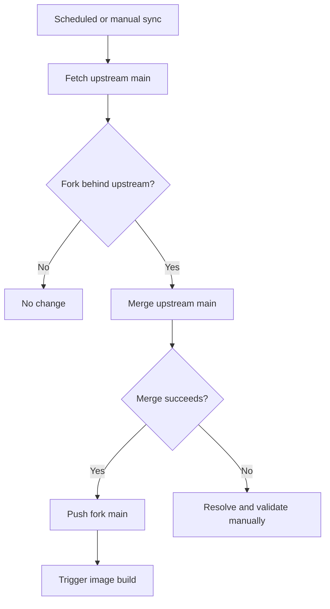

# Fork Differences

Language: [`English (primary / canonical)`](./fork-differences.md) · [`Traditional Chinese (translation)`](./fork-differences.zh-TW.md)

This document describes the current differences between [`DF-wu/lilac-mono`](https://github.com/DF-wu/lilac-mono) and [`stanley2058/lilac-mono`](https://github.com/stanley2058/lilac-mono).

The comparison baseline is `main` as of 2026-08-16: this fork includes upstream commit [`29100734`](https://github.com/stanley2058/lilac-mono/commit/291007344693f52cfccab392e642fe30ac2f04a0) and retains the following feature and operational changes on top of it.

> [!IMPORTANT]
> This is a maintenance document, not a permanent compatibility commitment. After an upstream sync, differences that have been accepted upstream or no longer exist must be removed from this table or reclassified.

## Current Fork-only Features

| Area | Difference | Entry point | Limitations or considerations |
| --- | --- | --- | --- |
| Telegram surface | Adds DM, group, and forum topic ingress; streamed HTML output; cancellation, reactions, command menus, outbound attachments, workflow cards/actions, and same-surface tools | [`telegram-surface.md`](./telegram-surface.md), fork PR [#45](https://github.com/DF-wu/lilac-mono/pull/45) | Disabled by default; no inbound attachment bytes; long polling only; history comes from the local SQLite index |
| OpenAI-compatible image routing | Uses v2 config to route all existing `generate.image` aliases to a single operator-specified endpoint | [`generate-image-openai-compatible.md`](./generate-image-openai-compatible.md), fork PR [#47](https://github.com/DF-wu/lilac-mono/pull/47) | No custom alias mapping, official-provider fallback, or cross-provider retry; `aspectRatio` produces only a warning for some aliases |
| GitHub reply permalinks | `In reply to` links point to the specified issue/PR body or comment anchor | [`github-reply-permalinks.md`](./github-reply-permalinks.md), fork PR [#49](https://github.com/DF-wu/lilac-mono/pull/49) | Body targets require the issue database ID; falls back to the thread URL when unavailable |
| Custom media plugin example | Provides an external Level 2 image/video plugin using an OpenAI-compatible image API and a QuantumNous/new-api-compatible video flow | [`custom-media/README.md`](../examples/plugins/custom-media/README.md), fork PR [#30](https://github.com/DF-wu/lilac-mono/pull/30) | Plugins are trusted in-process code; restricted callers currently cannot use external callables directly |
| ACP controller reliability | Detached runs treat Linux zombie workers as stopped, and cancellation closes the harness client so the worker can settle | Commit [`91ef3fd`](https://github.com/DF-wu/lilac-mono/commit/91ef3fd6) | Zombie detection is Linux-specific; available harnesses still depend on local discovery |
| Compatible-provider tool calls | When a compatible provider returns a nonstandard finish reason such as `other`, parsed local tool calls are still executed and their results preserved | Commit [`1c58e532`](https://github.com/DF-wu/lilac-mono/commit/1c58e532201ee51782c98c1d8b16086f6bf45c34) | Trusts only local tool calls that passed the parser; arbitrary provider text is not treated as a tool invocation |
| Container delivery | The build workflow publishes `catalina`, `claudia`, and SHA tags, with `latest` pointing to `catalina`; the image also includes `rsync` | [`build-image.yml`](../.github/workflows/build-image.yml), [`Dockerfile`](../Dockerfile) | Both tags currently use the same Dockerfile user and UID; the Dockerfile does not use the `CONTAINER_USER` build arg, so these are not actual user variants |
| Upstream maintenance | A scheduled workflow fetches upstream `main` every 6 hours, attempts a merge when new commits exist, and triggers an image build after a successful merge | [`sync-upstream.yml`](../.github/workflows/sync-upstream.yml) | Merge conflicts fail the workflow and require manual integration and validation |

## Current Telegram Status

Telegram is currently the largest fork-only product delta. The main implemented paths include:

- DMs, groups, supergroups, and forum topics.
- Mention/active routing, streamed edits, HTML rendering, and 4096-character chunking.
- Reply context, cancellation, typing indicators, reactions, custom commands, and menu aliases.
- Outbound attachments, workflow progress/actions, `waitForReply`, and allowlist-bound surface tools.

Items that remain unimplemented or are constrained by the platform:

- Inbound photo/document bytes are not sent to the model; captions can still trigger a request. Tracked in [issue #42](https://github.com/DF-wu/lilac-mono/issues/42).
- Only long polling is supported; there is no webhook ingress.
- There is no Telegram-native conversation search index, inline query support, business account support, or voice/video transcription.
- Message history includes only content the bot actually observed or sent, not Telegram's complete pre-existing history.

See [`telegram-surface.md`](./telegram-surface.md#10-what-works-and-what-does-not) for the precise feature matrix and platform differences.

## Accepted Upstream Contributions

The following capabilities currently exist in this fork but no longer constitute fork divergence:

| Original contribution | Upstream status | Classification |
| --- | --- | --- |
| Configurable Exa web search provider | Upstream PR [#1](https://github.com/stanley2058/lilac-mono/pull/1) has been merged | Treated as an inherited upstream capability |
| `TAVILY_API_BASE_URL` and related normalization/docs | Upstream PRs [#4](https://github.com/stanley2058/lilac-mono/pull/4) and [#5](https://github.com/stanley2058/lilac-mono/pull/5) have been merged | Treated as an inherited upstream capability |
| GitHub agent-comment marker, safe trigger parsing, and self-trigger loop prevention | Upstream PR [#13](https://github.com/stanley2058/lilac-mono/pull/13) has been merged | Not listed as a fork-only GitHub difference |

## Items That Should Not Be Listed as Current Differences

- **Core runtime, Discord, GitHub webhook foundation, event bus, workflows, tools, plugins, and Mini Lilac**: these primarily come from upstream. The README may describe them normally, but they must not be credited to this fork.
- **Architecture Atlas**: the related workspace and functionality have been fully reverted.
- **Fork-specific Discord working-indicator defaults**: these have been restored to the upstream defaults.
- **Old empty-reply feature flag**: this has been reverted or superseded by later upstream behavior.
- **`smart-search` foundational runtime**: the relevant implementation is not currently present in the tree. It is reverted/superseded behavior, not a current container capability.

## Compatibility and Security Boundaries

This fork retains the main upstream architecture and config migration policy, but new features may require `configVersion: 2`. Greenfield changes may be breaking changes; read [`../MIGRATIONS.md`](../MIGRATIONS.md) before upgrading.

The following mechanisms are guardrails or trusted execution, not hostile-code sandboxes:

- Core and Mini Bash/filesystem checks.
- Programmatic workflow policy.
- External plugins and MCP stdio processes.
- Tool server request capabilities.
- Filesystem access between processes running under the same UID inside Docker.

For deployment, also read [`docker-deployment.md`](./docker-deployment.md) and [`../PROJECT.md`](../PROJECT.md).

## Upstream Sync Policy



Sync principles:

1. Preserve upstream commit history by integrating with merges.
2. Fork-only features must have independent tests and documentation so their behavior does not have to be inferred from commit messages during a sync.
3. After upstream accepts equivalent functionality, compare the contracts before removing the duplicate patch and its fork-only claim from this document.
4. When conflicts occur, do not obtain a green sync by ignoring tests or directly overwriting fork behavior.

## Updating This Document

Whenever a fork-only feature is added or a major upstream sync is completed, run at least the following checks:

```bash
git fetch origin
git fetch upstream
git log --no-merges upstream/main..origin/main
git diff --stat upstream/main..origin/main
```

Distinguish among these classifications:

- **Fork-only**: upstream does not currently provide an equivalent contract.
- **Inherited**: comes directly from upstream.
- **Upstream-accepted**: originally contributed by the fork, but now available in both repositories.
- **Reverted/superseded**: no longer exists and should not appear in the README feature list.
