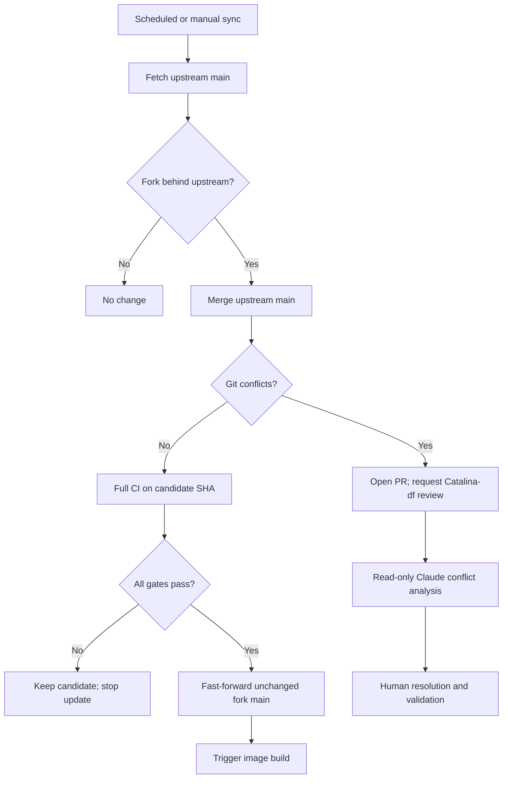

# Fork Differences

Language: [`English (primary / canonical)`](./fork-differences.md) · [`Traditional Chinese (translation)`](./fork-differences.zh-TW.md)

This document describes the current differences between [`DF-wu/lilac-mono`](https://github.com/DF-wu/lilac-mono) and [`stanley2058/lilac-mono`](https://github.com/stanley2058/lilac-mono).

The comparison baseline is upstream commit [`0c906d23`](https://github.com/stanley2058/lilac-mono/commit/0c906d23), included by the PR #85 integration candidate on 2026-10-07. The fork retains the following feature and operational changes on top of it.

> [!IMPORTANT]
> This is a maintenance document, not a permanent compatibility commitment. After an upstream sync, differences that have been accepted upstream or no longer exist must be removed from this table or reclassified.

## Current Fork-only Features

| Area | Difference | Entry point | Limitations or considerations |
| --- | --- | --- | --- |
| Telegram surface | Adds DM, group, and forum topic ingress; streamed HTML output; cancellation, reactions, command menus, inbound/outbound attachments, workflow cards/actions, same-surface tools, and participation in cross-surface conversation memory (one indexed thread per chat or topic, gated by `allowedChatIds`) | [`telegram-surface.md`](./telegram-surface.md), fork PRs [#45](https://github.com/DF-wu/lilac-mono/pull/45) and [#75](https://github.com/DF-wu/lilac-mono/pull/75) | Disabled by default; long polling only; history comes from the local SQLite index |
| Structured `generate.image` | Upstream commit [`05115838`](https://github.com/stanley2058/lilac-mono/commit/05115838) replaced `generate.image` with a JavaScript script runner (`image-script.ts`, a `providers` global, and per-provider recipes in the `image-generation` skill). The fork keeps the structured prompt / model-alias / size / mask / `outputDir` tool, its tests, and a skill that documents that contract; one alias capability catalog drives validation and routing, and results carry `providerMetadata` | [`apps/core/src/tool-server/tools/generate-image/`](../apps/core/src/tool-server/tools/generate-image/), [`generate-image-openai-compatible.md`](./generate-image-openai-compatible.md), fork PR [#76](https://github.com/DF-wu/lilac-mono/pull/76) | Upstream's script recipes are unavailable; agents cannot run arbitrary image scripts through `generate.image`. This is the largest tool-contract divergence and must be re-evaluated on every sync that touches `tools/generate.ts` |
| OpenAI-compatible image routing | Uses v2 config to route `generate.image` aliases: a bulk `provider` for all aliases, an optional alias allowlist, and per-alias `routes` as `<provider>/<model id>` (`openai`, `openrouter`, `xai`, `openai-compatible`); ratio-driven aliases forward `aspectRatio` as a colon-form `size`; a fork-owned image client names multipart edit uploads | [`generate-image-openai-compatible.md`](./generate-image-openai-compatible.md), fork PRs [#47](https://github.com/DF-wu/lilac-mono/pull/47) and [#76](https://github.com/DF-wu/lilac-mono/pull/76) | No official-provider fallback or cross-provider retry |
| OpenAI `web.search` provider | `tools.web.extract.providers` accepts `openai`: `web.search` runs the OpenAI Responses `web_search` tool (forced via `tool_choice: required`) and returns the answer's URL citations followed by uncited retrieved sources; `tools.web.openai.{model,searchContextSize}` tune it, and `model` is a `provider/model` spec on the `openai` or `openai-compatible` provider. Search-only: `web.extract` skips it | [`web-search-openai.md`](./web-search-openai.md), [`core-config-migrations.md`](./core-config-migrations.md), `apps/core/src/tool-server/tools/web-search/openai-web-search-provider.ts` | Staged for an upstream contribution (not yet submitted); needs direct `api.openai.com` or a gateway that implements Responses `web_search`; no publish-date filter beyond model instructions |
| GitHub final-publication policy | Issue and PR-review prompts tell the agent that Lilac publishes the final response itself: the agent must not repost it through `gh`, the GitHub API, or `surface.messages.send`, and returns `NO_REPLY` after publishing directly or after a successful `gh pr review` submission | `apps/core/src/github/webhook/github-webhook-server.ts`, fork PR [#56](https://github.com/DF-wu/lilac-mono/pull/56) | Prompt guidance only; a model that ignores it can still post a duplicate. |
| Custom media plugin example | Provides an external Level 2 image/video plugin using an OpenAI-compatible image API and a QuantumNous/new-api-compatible video flow | [`custom-media/README.md`](../examples/plugins/custom-media/README.md), fork PR [#30](https://github.com/DF-wu/lilac-mono/pull/30) | Plugins are trusted in-process code; restricted callers currently cannot use external callables directly |
| Protected current-input compaction | Core validates the active input boundary before threshold checks, skips soft compaction without older history, and preserves current input verbatim when summarizing older history. Callers without a protected boundary retain upstream active-request compaction | `packages/agent/auto-compaction.ts`, `apps/core/src/surface/bridge/bus-agent-runner.ts`, fork PR [#82](https://github.com/DF-wu/lilac-mono/pull/82) | Real overflow still follows the existing recovery/failure path; skipping the soft trigger does not guarantee the next request fits |
| Compatible-provider tool calls | When a compatible provider returns a nonstandard finish reason such as `other`, parsed local tool calls are still executed and their results preserved | Commit [`1c58e532`](https://github.com/DF-wu/lilac-mono/commit/1c58e532201ee51782c98c1d8b16086f6bf45c34) | Trusts only local tool calls that passed the parser; arbitrary provider text is not treated as a tool invocation |
| Container delivery | The build workflow publishes verified `catalina`, `claudia`, and SHA tags, with `latest` pointing to `catalina`; each variant has its own account and home directory, and the image also includes `rsync` | [`build-image.yml`](../.github/workflows/build-image.yml), [`Dockerfile`](../Dockerfile) | Both published variants use UID/GID 3000; host bind mounts must grant that numeric identity access |
| Upstream maintenance | Every 6 hours, verify clean candidate merges with full CI before updating `main` and publishing images; Git conflicts open a PR with read-only Claude analysis and request `Catalina-df` review | [`sync-upstream.yml`](../.github/workflows/sync-upstream.yml), [configuration](./upstream-sync.md) | CI failures stop the update; humans resolve conflicts and validate integration |

## Current Telegram Status

Telegram is currently the largest fork-only product delta. The main implemented paths include:

- DMs, groups, supergroups, and forum topics.
- Mention/active routing through a router that mirrors the upstream Discord router (debounce batching, the shared LLM gate, steer/interrupt/follow-up, `!model:`/`!continue`/`!interrupt` directives), streamed edits, HTML rendering, and 4096-character chunking.
- Reply context, cancellation, typing indicators, reactions, custom commands, and menu aliases.
- Inbound photos/documents, outbound attachments, workflow progress/actions, `waitForReply`, and allowlist-bound surface tools.
- Conversation memory: Telegram chats are indexed, summarized, searched, and auto-recalled through the shared cross-surface thread store, gated by `allowedChatIds` (see [`telegram-surface.md`](./telegram-surface.md#conversation-memory)).

Items that remain unimplemented or are constrained by the platform:

- Only long polling is supported; there is no webhook ingress.
- Conversation memory indexes one thread per chat or topic (no segmentation of long chats), has no run-in-progress signal, and projects attachments as metadata only; Lilac `/?ref=telegram:` references are not recognized yet.
- There is no inline query support, business account support, or voice/video transcription.
- Message history includes only content the bot actually observed or sent, not Telegram's complete pre-existing history.
- The ask-user question port, session divider, `/model` and `/context` commands, reasoning text, skipped-output cleanup, and several Level 2 tool operations remain Discord-only.

See [`telegram-surface.md`](./telegram-surface.md#10-what-works-and-what-does-not) for the operator-facing feature matrix, and [`telegram-feature-parity.md`](./telegram-feature-parity.md) for the capability-by-capability comparison with Discord, including why each gap exists and what closing it would take.

## Upstream Contributions

Every pull request this fork has opened against upstream, as of 2026-10-06. Merged contributions exist in both repositories and are no longer fork divergence; closed ones explain why a fork difference still exists or was dropped.

### Accepted Upstream Contributions

| Original contribution | Upstream status | Classification |
| --- | --- | --- |
| Configurable Exa web search provider | Upstream PR [#1](https://github.com/stanley2058/lilac-mono/pull/1) merged 2026-02-19 | Treated as an inherited upstream capability |
| `TAVILY_API_BASE_URL` and related normalization/docs | Upstream PRs [#4](https://github.com/stanley2058/lilac-mono/pull/4) and [#5](https://github.com/stanley2058/lilac-mono/pull/5) merged 2026-02-20 and 2026-02-21 | Treated as an inherited upstream capability |
| GitHub agent-comment marker, safe trigger parsing, and self-trigger loop prevention | Upstream PR [#13](https://github.com/stanley2058/lilac-mono/pull/13) merged 2026-06-08 | Not listed as a fork-only GitHub difference |
| GitHub reply permalinks: `In reply to` links to the referenced issue/PR body or comment anchor on the configured GitHub host (GHES aware), in agent replies and workflow progress messages ([`github-reply-permalinks.md`](./github-reply-permalinks.md)) | Upstream PR [#35](https://github.com/stanley2058/lilac-mono/pull/35) merged 2026-10-05, from fork PRs [#49](https://github.com/DF-wu/lilac-mono/pull/49) and [#78](https://github.com/DF-wu/lilac-mono/pull/78); synced in [`ca808ccb`](https://github.com/DF-wu/lilac-mono/commit/ca808ccb) | Inherited upstream capability; the fork's six permalink seams and two tests now match upstream and left the footprint allowlist |

### Closed Without Merge

| Pull request | Outcome | Fork status |
| --- | --- | --- |
| Upstream PR [#22](https://github.com/stanley2058/lilac-mono/pull/22), GitHub reply comment links | Closed by the author on 2026-07-30 to rework on the fork first (hard-coded `github.com` host) | Superseded by upstream PR [#35](https://github.com/stanley2058/lilac-mono/pull/35) |
| Upstream PR [#15](https://github.com/stanley2058/lilac-mono/pull/15), custom image generation providers for `generate.image` | Closed on 2026-07-12 without merge; upstream later replaced `generate.image` with a script runner (commit [`05115838`](https://github.com/stanley2058/lilac-mono/commit/05115838)) | Kept as the fork-only structured `generate.image` and OpenAI-compatible image routing above |
| Upstream PR [#14](https://github.com/stanley2058/lilac-mono/pull/14), Discord stats-for-nerds in the plain preview final reply | Draft opened by accident; closed on 2026-06-15 after maintainer design feedback | Not carried by the fork |
| Upstream PR [#6](https://github.com/stanley2058/lilac-mono/pull/6), README refresh | Opened by mistake and closed | Not applicable |

### Not Yet Submitted

- **OpenAI `web.search` provider**: staged for an upstream contribution; its seams are grouped in the footprint allowlist so they can be removed once accepted.
- **Origin-session authority**: the first candidate for an upstream contribution, because it has no fork-owned module and lives entirely in upstream files.

## Items That Should Not Be Listed as Current Differences

- **Core runtime, Discord, GitHub webhook foundation, event bus, workflows, tools, and plugins**: these primarily come from upstream. The README may describe them normally, but they must not be credited to this fork.
- **Architecture Atlas**: the related workspace and functionality have been fully reverted.
- **Fork-specific Discord working-indicator defaults**: these have been restored to the upstream defaults.
- **Old empty-reply feature flag**: this has been reverted or superseded by later upstream behavior.
- **`smart-search` foundational runtime**: the relevant implementation is not currently present in the tree. It is reverted/superseded behavior, not a current container capability.

## Compatibility and Security Boundaries

This fork retains the main upstream architecture and config migration policy, but new features may require `configVersion: 2`. Greenfield changes may be breaking changes; read [`../MIGRATIONS.md`](../MIGRATIONS.md) before upgrading.

The following mechanisms are guardrails or trusted execution, not hostile-code sandboxes:

- Core Bash/filesystem checks.
- Programmatic workflow policy.
- External plugins and MCP stdio processes.
- Tool server request capabilities.
- Filesystem access between processes running under the same UID inside Docker.

For deployment, also read [`docker-deployment.md`](./docker-deployment.md) and [`../PROJECT.md`](../PROJECT.md).

## Fork Code Layout

The fork keeps behavior in fork-owned modules and touches upstream files only at thin seams: imports, one-line registrations, closed-union members, and re-exports. Anything that needs more than that is either contributed upstream or isolated behind a fork-owned entry point.

| Feature | Fork-owned modules | Upstream seams |
| --- | --- | --- |
| Telegram surface | `apps/core/src/surface/telegram/` (adapter, ingress, output, store, protocol, and the router split into `telegram-request-router.ts`, `telegram-request-router-composition.ts`, and `telegram-request-router-publish.ts`; the router mirrors the upstream Discord router and imports the shared helpers under `surface/discord/discord-request-router/` unchanged, see [`telegram-feature-parity.md`](./telegram-feature-parity.md)). `telegram-surface-runtime.ts` is the single wiring entry Core calls: startup adapter resolution, the runtime descriptor entry, config hot-reload, and workflow target authorization | `runtime/create-core-runtime.ts` (four call sites: startup adapter resolution, the runtime descriptor input, config hot-reload, and the workflow target authorizer), `runtime/compose-builtin-surface-runtimes.ts` (one descriptor entry), the closed platform unions in `surface/types.ts`, `builtin-surface-protocols.ts`, `bridge/request-ids.ts`, the attachment-resolver capability in `surface/adapter.ts`, platform-aware composition and relay refs under `surface/bridge/`, Telegram platform filters in `transcript/transcript-store.ts` and the legacy snapshot decoders, and, under `workflow/`, the domain types, engine, waits, operation policy, progress projector and view, trigger scheduler, and durable store (Telegram targets, `waitForReply`, progress cards, and target revalidation) |
| Telegram conversation memory | `apps/core/src/surface/telegram/telegram-conversation-source.ts` (SQL views over `telegram-surface.db`, projection decoders, attachment metadata) and the `telegramConversationMemoryInput` / `hydrateTelegramConversationAttachments` helpers in `telegram-surface-runtime.ts` | `conversation/thread-store.ts` (a third source branch, `telegram_thread` kind, allowlist clause), `thread-service.ts` (surface labels and allowlist checks), the summarization worker, its protocol, and `thread-worker.ts`, `runtime/create-core-runtime.ts` (attaches the source, hydrates Telegram refs, passes the worker paths, and adds `surface.telegram.botName` to the thread store's main-agent user names), `bus-agent-runner.ts` (recall surface label), `tool-server/tools/conversation-thread.ts` (enum), `packages/utils/prompt-templates/TOOLS.md` (Telegram `t.me` links) |
| Telegram configuration | `packages/utils/core-config/telegram-surface.ts` (type, defaults, v2 schema) and `telegram-runtime.ts` (token and database-path helpers) | `core-config/types.ts`, `v1.ts`, `v2.ts` (one field each) and `core-config.ts` re-exports |
| Structured `generate.image` | `apps/core/src/tool-server/tools/generate-image/` (`catalog`, `validation`, `input`, `routing`, `prompt`, `failures`, `callable`), `packages/utils/openai-compatible-image-provider.ts` (the compatible image client), and `apps/tool-bridge/create-plugin-manager.ts` (passes core config to the standalone bridge's plugin manager) | `tool-server/tools/generate.ts` (callable hook plus exported shared helpers), `plugins/builtin/server-tools.ts` (passes core config), `apps/tool-bridge/index.ts` (uses the fork plugin manager), and `packages/utils/index.ts` (re-export); upstream's `tools/image-script.ts` and `image-script-preload.ts` are deleted |
| Image routing configuration | `packages/utils/core-config/generate-image.ts` | The same config seams as above |
| OpenAI `web.search` provider | `apps/core/src/tool-server/tools/web-search/openai-web-search-provider.ts` (Responses request, citation decoding, snippet labeling), `openai-web-search-model.ts` (endpoint resolution for `tools.web.openai.model`), and `apps/core/tests/tools/web-search-openai*.test.ts` | `tools/web-search.ts` (export), `web-search/default-web-search-providers.ts` (registration), `resolve-provider.ts` (missing-key message), `web-search/types.ts` (provider id), `tools/web.ts` and `web/provider-page-extraction.ts` (environment and search-only skip), `core-config/types.ts` and `v2.ts` (`openai` provider id and `tools.web.openai`) |
| Command menu aliases | `packages/utils/custom-commands-menu.ts` (alias grammar, `@target`-aware token parsing) and `apps/core/src/custom-commands/menu-aliases.ts` (deterministic alias assignment) | `custom-commands/manager.ts` (alias index and parse options) and `packages/utils/index.ts` |
| Origin-session authority | None yet; the change lives in upstream files | `tool-server/create-tool-server.ts`, `request-control-authority.ts`, `tools/surface.ts`, `tools/bash-impl.ts`, `apps/tool-bridge/client.ts`, `packages/plugin-runtime/types.ts`. This is the first candidate for an upstream contribution |
| GitHub final-publication policy | None; the change lives in an upstream file | `github/webhook/github-webhook-server.ts` (issue and PR-review prompt publication policy). Reply permalinks now come from upstream PR #35 and no longer touch any seam |
| Agent and event bus fixes | None; the change lives in upstream files | `packages/agent/adapters/ai-sdk/adapter.ts` (tool calls on nonstandard finish reasons), `packages/agent/agent-run-idle-watchdog.ts` (restart gap), `packages/event-bus/redis-streams-bus.ts` (single-flight subscription cleanup) |
| Startup legacy blob migration | None; the change lives in upstream files | `runtime/main.ts` (runs the migration through `startCoreRuntime`), `apps/core/scripts/legacy-transcript-blob-migration.ts`, `docker/direct-entrypoint.sh` |
| Architecture gate | None | `scripts/architecture/manifest.ts`, `precise-exception-identities.ts`, and `core-final-boundary-identities.ts` register the fork modules; `architecture.test.ts` expects the Telegram request router event consumer |

`bun run fork:footprint` lists every upstream file that differs from the merge base with `upstream/main` and fails when one is missing from [`scripts/fork/upstream-footprint.txt`](../scripts/fork/upstream-footprint.txt), where each entry records why that seam exists. It also reports entries whose file no longer differs so the list shrinks as upstream accepts changes. CI runs it on every push to `main` and every pull request.

## Branch Policy

`main` is the only long-lived branch: upstream `main` plus the fork's features, always green. Other branches are short-lived and merge through a pull request. Clean automated upstream candidates are the exception: full CI (including the upstream-footprint job) runs before `main` fast-forwards to their existing commit. Only Git conflicts open an upstream synchronization PR.

| Prefix | Use | Lifetime |
| --- | --- | --- |
| `chore/sync-upstream-<run-id>-<attempt>` | Clean upstream merge candidate verified before updating `main` | Deleted after successful update/publication dispatch; retained on failure |
| `automation/sync-upstream` | Upstream conflict PR for human resolution and review | Deleted after the PR merges |
| `feat/`, `fix/`, `refactor/`, `docs/`, `test/` | One change each, named after the change (`feat/telegram-forum-topics`) | Deleted after the PR merges |
| `archive/<old-branch>` (tag, not branch) | Retired work whose commits are not in `main` but may be worth reading later | Permanent; never checked out for new work |

Rules:

- No `backup/`, `dep/`, `pr/`, or `review-*` branches. A pre-rebase safety point is a tag or a stash, and a branch that was opened as a pull request against upstream is deleted once upstream accepts or declines it.
- Delete a branch as soon as its PR merges; `git branch --merged origin/main` and `git cherry origin/main <branch>` decide whether anything unmerged remains.
- Worktrees follow the same rule: one per active branch, removed with the branch.
- Cleanup on 2026-09-26 archived 22 branches (one of them an uncommitted worktree) as `archive/*` tags and deleted 79 local and remote branches; only `main` remained.

## Upstream Sync Policy


```mermaid
flowchart TD
    Check[Scheduled or manual sync] --> Fetch[Fetch upstream main]
    Fetch --> Behind{Fork behind upstream?}
    Behind -->|No| Stop[No change]
    Behind -->|Yes| Merge[Merge upstream main]
    Merge --> Clean{Git conflicts?}
    Clean -->|No| CI[Full CI on candidate SHA]
    CI --> Passed{All gates pass?}
    Passed -->|No| Hold[Keep candidate; stop update]
    Passed -->|Yes| Push[Fast-forward unchanged fork main]
    Push --> Build[Trigger image build]
    Clean -->|Yes| PR[Open PR; request Catalina-df review]
    PR --> AI[Read-only Claude conflict analysis]
    AI --> Manual[Human resolution and validation]
```

Sync principles:

1. Preserve upstream commit history by integrating with merges.
2. Fork-only features must have independent tests and documentation so their behavior does not have to be inferred from commit messages during a sync.
3. After upstream accepts equivalent functionality, compare the contracts before removing the duplicate patch and its fork-only claim from this document.
4. When conflicts occur, do not obtain a green sync by ignoring tests or directly overwriting fork behavior.
5. After every sync and every fork change, run `bun run fork:footprint`. Remove stale entries, and move new leakage into a fork-owned module before adding an entry.

## Updating This Document

Whenever a fork-only feature is added or a major upstream sync is completed, run at least the following checks:

```bash
git fetch origin
git fetch upstream
git log --no-merges upstream/main..origin/main
gh pr list -R stanley2058/lilac-mono --author DF-wu --state all
git diff --stat upstream/main..origin/main
bun run fork:footprint
```

Distinguish among these classifications:

- **Fork-only**: upstream does not currently provide an equivalent contract.
- **Inherited**: comes directly from upstream.
- **Upstream-accepted**: originally contributed by the fork, but now available in both repositories.
- **Reverted/superseded**: no longer exists and should not appear in the README feature list.
