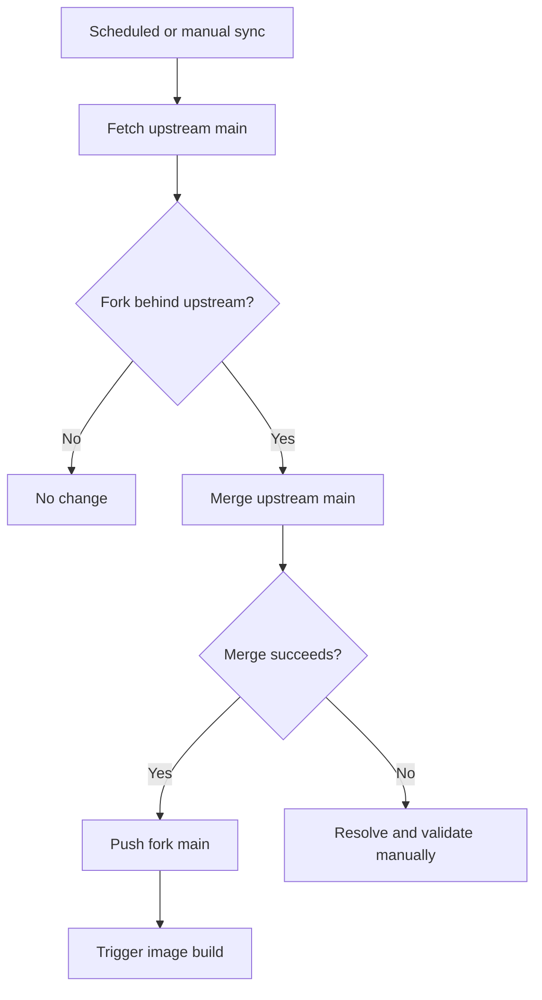

# Fork Differences

語言：[`English（主要／規範版本）`](./fork-differences.md) · [`繁體中文（翻譯）`](./fork-differences.zh-TW.md)

本文件描述 [`DF-wu/lilac-mono`](https://github.com/DF-wu/lilac-mono) 相對於 [`stanley2058/lilac-mono`](https://github.com/stanley2058/lilac-mono) 的現行差異。

比較基準為 2026-09-26 時與 upstream `main` 的 merge base：（fork PR [#68](https://github.com/DF-wu/lilac-mono/pull/68)）本 fork 已包含 upstream commit [`7f818a2e`](https://github.com/stanley2058/lilac-mono/commit/7f818a2e)，並在其上保留下列功能與維運修改。

> [!IMPORTANT]
> 這是維護文件，不是永久相容性承諾。Upstream sync 後，已被上游接收或不再存在的差異必須從本表移除或重新分類。

## 現行 Fork-only 功能

| 領域 | 差異 | 使用入口 | 限制或注意事項 |
| --- | --- | --- | --- |
| Telegram surface | 新增 DM、group、forum topic ingress；streamed HTML output；cancel、reaction、command menu、inbound/outbound attachments、workflow cards/actions、same-surface tools，並參與跨 surface 的 conversation memory（每個 chat 或 topic 一個 indexed thread，受 `allowedChatIds` 管制） | [`telegram-surface.md`](./telegram-surface.md)、fork PR [#45](https://github.com/DF-wu/lilac-mono/pull/45) | 預設停用；僅 long polling；history 來自 local SQLite index |
| 結構化 `generate.image` | Upstream commit [`05115838`](https://github.com/stanley2058/lilac-mono/commit/05115838) 將 `generate.image` 改成 JavaScript script runner（`image-script.ts`、`providers` global 與 `image-generation` skill 內的 per-provider recipes）。本 fork 保留結構化的 prompt / model alias / size / mask / `outputDir` 工具、其測試，以及描述該 contract 的 skill | [`apps/core/src/tool-server/tools/generate-image/`](../apps/core/src/tool-server/tools/generate-image/)、[`generate-image-openai-compatible.md`](./generate-image-openai-compatible.md) | 無法使用 upstream 的 script recipes；agent 不能透過 `generate.image` 執行任意 image script。這是最大的 tool contract 分歧，每次 sync 碰到 `tools/generate.ts` 時都要重新評估 |
| OpenAI-compatible image routing | 以 v2 config 將所有既有 `generate.image` aliases 路由到單一 operator endpoint，支援 alias allowlist 與 per-alias upstream model-ID overrides；ratio-driven aliases 會把 `aspectRatio` 以 colon-form `size` 轉送 | [`generate-image-openai-compatible.md`](./generate-image-openai-compatible.md)、fork PR [#47](https://github.com/DF-wu/lilac-mono/pull/47) | 無 official-provider fallback 或 cross-provider retry |
| GitHub reply permalinks | `In reply to` 連結會指向指定 issue/PR body 或 comment anchor | [`github-reply-permalinks.md`](./github-reply-permalinks.md)、fork PR [#49](https://github.com/DF-wu/lilac-mono/pull/49) | Body target 需要 issue database ID；取不到時退回 thread URL |
| Custom media plugin example | 提供 external Level 2 image/video plugin，使用 OpenAI-compatible image API 與 QuantumNous/new-api-compatible video flow | [`custom-media/README.md`](../examples/plugins/custom-media/README.md)、fork PR [#30](https://github.com/DF-wu/lilac-mono/pull/30) | Plugin 是 trusted in-process code；restricted callers 目前不能直接使用 external callables |
| Compatible-provider tool calls | Compatible provider 即使回傳 `other` 等非標準 finish reason，只要已解析出 local tool calls 仍會執行並保存結果 | Commit [`1c58e532`](https://github.com/DF-wu/lilac-mono/commit/1c58e532201ee51782c98c1d8b16086f6bf45c34) | 只信任已通過 parser 的 local tool calls；不會把任意 provider text 當成 tool invocation |
| Container delivery | Build workflow 發布經驗證的 `catalina`、`claudia` 與 SHA tags，`latest` 指向 `catalina`；每個 variant 都有各自的帳號與 home directory，image 另加入 `rsync` | [`build-image.yml`](../.github/workflows/build-image.yml)、[`Dockerfile`](../Dockerfile) | 兩個發布 variant 都使用 UID/GID 3000；host bind mounts 必須允許該數字身分存取 |
| Upstream maintenance | Scheduled workflow 每 6 小時 fetch upstream `main`，有新 commits 時嘗試 merge，成功後觸發 image build | [`sync-upstream.yml`](../.github/workflows/sync-upstream.yml) | Merge conflict 會使 workflow 失敗，必須人工整合與驗證 |

## Telegram 現況

Telegram 是目前最大的 fork-only product delta。已實作的主要路徑包括：

- DMs、groups、supergroups 與 forum topics。
- Mention/active routing、streamed edits、HTML rendering 與 4096-character chunking。
- Reply context、cancel、typing indicators、reactions、custom commands 與 menu aliases。
- Inbound photos/documents、outbound attachments、workflow progress/actions、`waitForReply` 與 allowlist-bound surface tools。
- 對話記憶：Telegram 聊天透過共用的跨 surface thread store 被索引、摘要、搜尋與自動召回，並以 `allowedChatIds` 把關（見 [`telegram-surface.md`](./telegram-surface.md#conversation-memory)）。

仍未實作或受平台限制的項目：

- 只有 long polling，沒有 webhook ingress。
- 對話記憶以每個聊天或 topic 為一個 thread（長聊天室不分段）、沒有 run-in-progress 訊號、附件只保留 metadata；尚未辨識 Lilac 的 `/?ref=telegram:` 參照。
- 沒有 inline queries、business accounts 或 voice/video transcription。
- Message history 只包含 bot 實際觀察或送出的內容，不是 Telegram 既有完整歷史。

精確 feature matrix 與平台差異以 [`telegram-surface.md`](./telegram-surface.md#10-what-works-and-what-does-not) 為準。

## 已被上游接收的貢獻

以下能力目前存在於本 fork，但已不再構成 fork divergence：

| 原始貢獻 | Upstream 狀態 | 分類方式 |
| --- | --- | --- |
| Configurable Exa web search provider | Upstream PR [#1](https://github.com/stanley2058/lilac-mono/pull/1) 已 merge | 視為 inherited upstream capability |
| `TAVILY_API_BASE_URL` 與相關 normalization/docs | Upstream PR [#4](https://github.com/stanley2058/lilac-mono/pull/4)、[#5](https://github.com/stanley2058/lilac-mono/pull/5) 已 merge | 視為 inherited upstream capability |
| GitHub agent-comment marker、safe trigger parsing 與 self-trigger loop prevention | Upstream PR [#13](https://github.com/stanley2058/lilac-mono/pull/13) 已 merge | 不列入 fork-only GitHub 差異 |

## 不應列為現行差異

- **Core runtime、Discord、GitHub webhook 基礎、event bus、workflows、tools 與 plugins**：它們主要來自 upstream。README 可以正常介紹，但不能歸功於本 fork。
- **Architecture Atlas**：相關 workspace 與功能已完整 revert。
- **Fork-specific Discord working-indicator defaults**：已回復 upstream defaults。
- **舊 empty-reply feature flag**：已 revert 或由後續 upstream 行為取代。
- **`smart-search` 基礎 runtime**：相關實作目前不存在於 tree，屬於 reverted/superseded 行為，不是現行 container capability。

## 相容性與安全邊界

本 fork 保留 upstream 的主要架構與 config migration policy，但新增功能可能需要 `configVersion: 2`。Greenfield changes 可能是 breaking changes；升級前請閱讀 [`../MIGRATIONS.md`](../MIGRATIONS.md)。

下列機制是 guardrails 或 trusted execution，不是 hostile-code sandbox：

- Core 與 Mini 的 Bash/filesystem checks。
- Programmatic workflow policy。
- External plugins 與 MCP stdio processes。
- Tool server request capabilities。
- Docker 內同 UID process 之間的 filesystem access。

部署時請同時閱讀 [`docker-deployment.md`](./docker-deployment.md) 與 [`../PROJECT.md`](../PROJECT.md)。

## Fork 程式碼配置

本 fork 把行為放在 fork 自有的模組裡，對 upstream 檔案只保留很薄的接縫：import、單行註冊、closed union 的成員與 re-export。需要更多改動的部分，不是回饋給 upstream，就是藏到 fork 自有的進入點後面。

| 功能 | Fork 自有模組 | Upstream 接縫 |
| --- | --- | --- |
| Telegram surface | `apps/core/src/surface/telegram/`（adapter、ingress、router、output、store、protocol）。`telegram-surface-runtime.ts` 是 Core 唯一呼叫的接線入口：啟動時的 adapter 解析、runtime descriptor entry、config hot-reload 與 workflow target 授權 | `runtime/create-core-runtime.ts`（四個單行呼叫點）、`runtime/compose-builtin-surface-runtimes.ts`（一個 descriptor entry）、`surface/types.ts` 的 closed platform unions、`builtin-surface-protocols.ts`、`bridge/request-ids.ts` 與 workflow target 型別 |
| Telegram conversation memory | `apps/core/src/surface/telegram/telegram-conversation-source.ts`（覆蓋 `telegram-surface.db` 的 SQL views、projection decoders、attachment metadata）以及 `telegram-surface-runtime.ts` 裡的 `telegramConversationMemoryInput` / `hydrateTelegramConversationAttachments` | `conversation/thread-store.ts`（第三個 source 分支、`telegram_thread` kind、allowlist 子句）、`thread-service.ts`（surface 標籤與 allowlist 檢查）、summarization worker protocol、`bus-agent-runner.ts`（recall 的 surface 標籤）、`tool-server/tools/conversation-thread.ts`（enum） |
| Telegram 設定 | `packages/utils/core-config/telegram-surface.ts`（型別、預設值、v2 schema）與 `telegram-runtime.ts`（token 與 database path helpers） | `core-config/types.ts`、`v1.ts`、`v2.ts`（各一個欄位）與 `core-config.ts` 的 re-export |
| 結構化 `generate.image` | `apps/core/src/tool-server/tools/generate-image/`（`input`、`models`、`prompt`、`routing`、`callable`） | `tool-server/tools/generate.ts`（callable hook 與 export 出來的共用 helpers）與 `plugins/builtin/server-tools.ts`（傳入 core config） |
| Image routing 設定 | `packages/utils/core-config/generate-image.ts` | 同上的 config 接縫 |
| Command menu aliases | `packages/utils/custom-commands-menu.ts`（alias 文法、會檢查 `@target` 的 token parsing）與 `apps/core/src/custom-commands/menu-aliases.ts`（確定性的 alias 指派） | `custom-commands/manager.ts`（alias index 與 parse options）與 `packages/utils/index.ts` |
| Origin-session authority | 尚無；改動仍在 upstream 檔案裡 | `tool-server/create-tool-server.ts`、`request-control-authority.ts`、`tools/surface.ts`、`tools/bash-impl.ts`、`apps/tool-bridge/client.ts`、`packages/plugin-runtime/types.ts`。這是第一個應回饋 upstream 的候選 |
| Architecture gate | 無 | `scripts/architecture/manifest.ts`、`precise-exception-identities.ts` 與 `core-final-boundary-identities.ts` 註冊 fork 模組 |

`bun run fork:footprint` 會列出所有相對於 `upstream/main` merge base 有差異的 upstream 檔案，遇到不在 [`scripts/fork/upstream-footprint.txt`](../scripts/fork/upstream-footprint.txt) 裡的檔案就失敗；清單中每一筆都記錄該接縫存在的理由。它也會回報檔案已不再有差異的過期項目，讓清單隨著 upstream 接收改動而縮小。CI 在每次 push 與 pull request 都會執行。

## Branch 政策

`main` 是唯一的長期分支：upstream `main` 加上本 fork 的功能，且永遠保持綠燈。其他分支都是短命的，一律透過 pull request 合入 `main`，讓 CI（含 upstream-footprint job）先跑過。

| 前綴 | 用途 | 生命週期 |
| --- | --- | --- |
| `chore/sync-upstream-YYYYMMDD` | 合併 upstream `main`、解衝突，以及讓 fork 功能配合新 upstream 所需的後續修正 | PR 合併後刪除 |
| `feat/`、`fix/`、`refactor/`、`docs/`、`test/` | 一個分支一件事，以改動內容命名（`feat/telegram-forum-topics`） | PR 合併後刪除 |
| `archive/<舊分支名>`（tag，不是 branch） | 已退役、commits 不在 `main` 但日後可能要查閱的工作 | 永久保留；不再從它開新工作 |

規則：

- 不再使用 `backup/`、`dep/`、`pr/`、`review-*` 分支。rebase 前的安全點用 tag 或 stash；對 upstream 開 PR 的分支，在 upstream 接受或拒絕後即刪除。
- PR 合併後立即刪除分支；用 `git branch --merged origin/main` 與 `git cherry origin/main <branch>` 判斷是否還有未合入的內容。
- Worktree 比照辦理：一個進行中的分支對應一個 worktree，分支刪除時一併移除。
- 2026-09-26 的整理將 22 個分支（其中一個是未 commit 的 worktree）封存為 `archive/*` tags，並刪除了 79 個本地與遠端分支；最後只留下 `main`。

## Upstream Sync Policy



同步原則：

1. 保留 upstream commit history，以 merge 方式整合。
2. Fork-only features 必須有獨立 tests 與文件，避免 sync 時只能依賴 commit message 猜測行為。
3. Upstream 接收同等功能後，先比較 contract，再移除重複 patch 與本文件中的 fork-only claim。
4. 發生 conflict 時不以忽略 tests 或直接覆蓋 fork behavior 的方式換取綠色 sync。
5. 每次 sync 與每次 fork 改動後都執行 `bun run fork:footprint`。移除過期項目；新的外溢先搬進 fork 自有模組，再考慮新增項目。

## 更新本文件

每次新增 fork-only feature 或完成大型 upstream sync 時，至少核對：

```bash
git fetch origin
git fetch upstream
git log --no-merges upstream/main..origin/main
git diff --stat upstream/main..origin/main
bun run fork:footprint
```

分類時要區分：

- **Fork-only**：目前 upstream 沒有同等 contract。
- **Inherited**：直接來自 upstream。
- **Upstream-accepted**：最初由 fork 貢獻，但現在兩邊都具備。
- **Reverted/superseded**：不再存在，不應出現在 README feature list。
