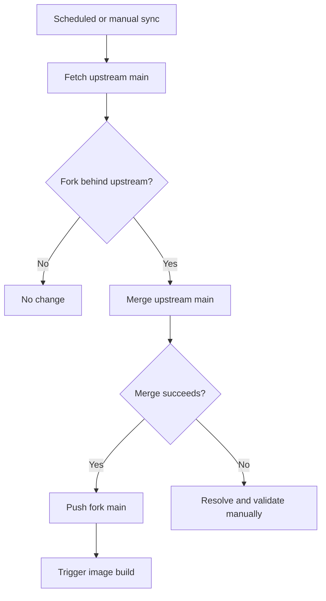

# Fork Differences

語言：[`English（主要／規範版本）`](./fork-differences.md) · [`繁體中文（翻譯）`](./fork-differences.zh-TW.md)

本文件描述 [`DF-wu/lilac-mono`](https://github.com/DF-wu/lilac-mono) 相對於 [`stanley2058/lilac-mono`](https://github.com/stanley2058/lilac-mono) 的現行差異。

比較基準為 2026-08-03 的 `main`：本 fork 已包含 upstream commit [`8f5fdec`](https://github.com/stanley2058/lilac-mono/commit/8f5fdec8266402560563885e901a4ffa6f40272b)，並在其上保留下列功能與維運修改。

> [!IMPORTANT]
> 這是維護文件，不是永久相容性承諾。Upstream sync 後，已被上游接收或不再存在的差異必須從本表移除或重新分類。

## 現行 Fork-only 功能

| 領域 | 差異 | 使用入口 | 限制或注意事項 |
| --- | --- | --- | --- |
| Telegram surface | 新增 DM、group、forum topic ingress；streamed HTML output；cancel、reaction、command menu、outbound attachments、workflow cards/actions 與 same-surface tools | [`telegram-surface.md`](./telegram-surface.md)、fork PR [#45](https://github.com/DF-wu/lilac-mono/pull/45) | 預設停用；沒有 inbound attachment bytes；僅 long polling；history 來自 local SQLite index |
| OpenAI-compatible image routing | 以 v2 config 將所有既有 `generate.image` aliases 路由到單一 operator endpoint | [`generate-image-openai-compatible.md`](./generate-image-openai-compatible.md)、fork PR [#47](https://github.com/DF-wu/lilac-mono/pull/47) | 無 custom alias mapping、official-provider fallback 或 cross-provider retry；部分 aliases 的 `aspectRatio` 只產生 warning |
| GitHub reply permalinks | `In reply to` 連結會指向指定 issue/PR body 或 comment anchor | [`github-reply-permalinks.md`](./github-reply-permalinks.md)、fork PR [#49](https://github.com/DF-wu/lilac-mono/pull/49) | Body target 需要 issue database ID；取不到時退回 thread URL |
| Custom media plugin example | 提供 external Level 2 image/video plugin，使用 OpenAI-compatible image API 與 QuantumNous/new-api-compatible video flow | [`custom-media/README.md`](../examples/plugins/custom-media/README.md)、fork PR [#30](https://github.com/DF-wu/lilac-mono/pull/30) | Plugin 是 trusted in-process code；restricted callers 目前不能直接使用 external callables |
| ACP controller reliability | Detached run 將 Linux zombie worker 視為已停止，cancel 時關閉 harness client 讓 worker settle | Commit [`91ef3fd`](https://github.com/DF-wu/lilac-mono/commit/91ef3fd6) | Zombie detection 為 Linux-specific；可用 harness 仍取決於本機 discovery |
| Compatible-provider tool calls | Compatible provider 即使回傳 `other` 等非標準 finish reason，只要已解析出 local tool calls 仍會執行並保存結果 | Commit [`1c58e532`](https://github.com/DF-wu/lilac-mono/commit/1c58e532201ee51782c98c1d8b16086f6bf45c34) | 只信任已通過 parser 的 local tool calls；不會把任意 provider text 當成 tool invocation |
| Container delivery | Build workflow 發布經驗證的 `catalina`、`claudia` 與 SHA tags，`latest` 指向 `catalina`；每個 variant 都有各自的帳號與 home directory，image 另加入 `rsync` | [`build-image.yml`](../.github/workflows/build-image.yml)、[`Dockerfile`](../Dockerfile) | 兩個發布 variant 都使用 UID/GID 3000；host bind mounts 必須允許該數字身分存取 |
| Upstream maintenance | Scheduled workflow 每 6 小時 fetch upstream `main`，有新 commits 時嘗試 merge，成功後觸發 image build | [`sync-upstream.yml`](../.github/workflows/sync-upstream.yml) | Merge conflict 會使 workflow 失敗，必須人工整合與驗證 |

## Telegram 現況

Telegram 是目前最大的 fork-only product delta。已實作的主要路徑包括：

- DMs、groups、supergroups 與 forum topics。
- Mention/active routing、streamed edits、HTML rendering 與 4096-character chunking。
- Reply context、cancel、typing indicators、reactions、custom commands 與 menu aliases。
- Outbound attachments、workflow progress/actions、`waitForReply` 與 allowlist-bound surface tools。

仍未實作或受平台限制的項目：

- Inbound photo/document bytes 不會送入 model；caption 仍可觸發 request。追蹤於 [issue #42](https://github.com/DF-wu/lilac-mono/issues/42)。
- 只有 long polling，沒有 webhook ingress。
- 沒有 Telegram-native conversation search index、inline queries、business accounts 或 voice/video transcription。
- Message history 只包含 bot 實際觀察或送出的內容，不是 Telegram 既有完整歷史。

精確 feature matrix 與平台差異以 [`telegram-surface.md`](./telegram-surface.md#10-what-works-and-what-does-not) 為準。

## 已被上游接收的貢獻

以下能力目前存在於本 fork，但已不再構成 fork divergence：

| 原始貢獻 | Upstream 狀態 | 分類方式 |
| --- | --- | --- |
| Configurable Exa web search provider | Upstream PR [#1](https://github.com/stanley2058/lilac-mono/pull/1) 已 merge | 視為 inherited upstream capability |
| `TAVILY_API_BASE_URL` 與相關 normalization/docs | Upstream PR [#4](https://github.com/stanley2058/lilac-mono/pull/4)、[#5](https://github.com/stanley2058/lilac-mono/pull/5) 已 merge | 視為 inherited upstream capability |
| GitHub agent-comment marker、safe trigger parsing 與 self-trigger loop prevention | Upstream PR [#13](https://github.com/stanley2058/lilac-mono/pull/13) 已 merge | 不列入 fork-only GitHub 差異 |

## 不應列為現行差異

- **Core runtime、Discord、GitHub webhook 基礎、event bus、workflows、tools、plugins、Mini Lilac**：它們主要來自 upstream。README 可以正常介紹，但不能歸功於本 fork。
- **Architecture Atlas**：相關 workspace 與功能已完整 revert。
- **Fork-specific Discord working-indicator defaults**：已回復 upstream defaults。
- **舊 empty-reply feature flag**：已 revert 或由後續 upstream 行為取代。
- **`smart-search` 基礎 runtime**：相關實作目前不存在於 tree，屬於 reverted/superseded 行為，不是現行 container capability。

## 相容性與安全邊界

本 fork 保留 upstream 的主要架構與 config migration policy，但新增功能可能需要 `configVersion: 2`。Greenfield changes 可能是 breaking changes；升級前請閱讀 [`../MIGRATIONS.md`](../MIGRATIONS.md)。

下列機制是 guardrails 或 trusted execution，不是 hostile-code sandbox：

- Core 與 Mini 的 Bash/filesystem checks。
- Programmatic workflow policy。
- External plugins 與 MCP stdio processes。
- Tool server request capabilities。
- Docker 內同 UID process 之間的 filesystem access。

部署時請同時閱讀 [`docker-deployment.md`](./docker-deployment.md) 與 [`../PROJECT.md`](../PROJECT.md)。

## Upstream Sync Policy



同步原則：

1. 保留 upstream commit history，以 merge 方式整合。
2. Fork-only features 必須有獨立 tests 與文件，避免 sync 時只能依賴 commit message 猜測行為。
3. Upstream 接收同等功能後，先比較 contract，再移除重複 patch 與本文件中的 fork-only claim。
4. 發生 conflict 時不以忽略 tests 或直接覆蓋 fork behavior 的方式換取綠色 sync。

## 更新本文件

每次新增 fork-only feature 或完成大型 upstream sync 時，至少核對：

```bash
git fetch origin
git fetch upstream
git log --no-merges upstream/main..origin/main
git diff --stat upstream/main..origin/main
```

分類時要區分：

- **Fork-only**：目前 upstream 沒有同等 contract。
- **Inherited**：直接來自 upstream。
- **Upstream-accepted**：最初由 fork 貢獻，但現在兩邊都具備。
- **Reverted/superseded**：不再存在，不應出現在 README feature list。
