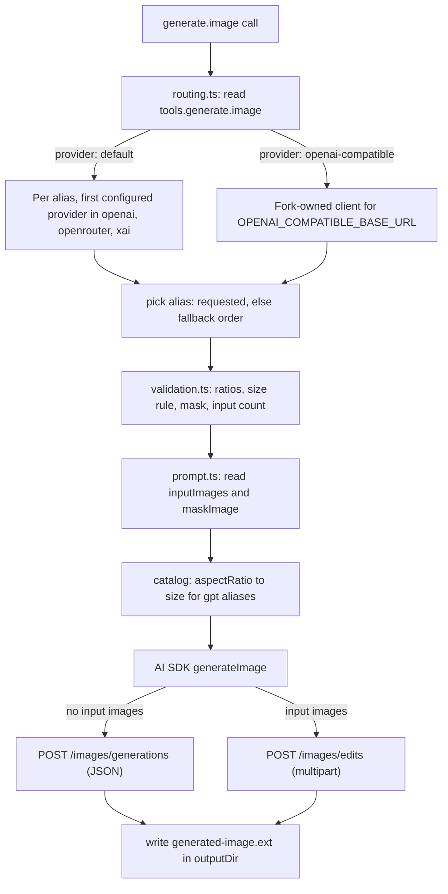

# Structured `generate.image` And OpenAI-Compatible Routing

`generate.image` is the fork's structured image tool: a prompt, a Lilac model
alias, optional dimensions, optional input images and a mask, and an output
directory. Upstream replaced it with a script runner; the fork keeps the
structured contract (see [`fork-differences.md`](./fork-differences.md)) and
adds a routing switch that sends every alias to one OpenAI-compatible endpoint.

This document covers how the tool is put together, how requests flow in both
routing modes, and how to configure and troubleshoot the OpenAI-compatible
route. Switching the route changes the request destination only: aliases,
input validation, image editing, and output handling stay the same.

## How it works

Everything specific to the tool lives in fork-owned modules so upstream merges
stay mechanical:

| Module | Owns |
| --- | --- |
| `apps/core/src/tool-server/tools/generate-image/catalog.ts` | One capability entry per alias: upstream model ID per provider, accepted aspect ratios, the size rule, mask support, and input-image limits; the fallback order; ratio-to-size mapping |
| `.../generate-image/validation.ts` | Checks a request against the alias's catalog entry before any HTTP request |
| `.../generate-image/input.ts` | The zod input schema; the `size` and `aspectRatio` help text is generated from the catalog |
| `.../generate-image/routing.ts` | Resolves the default route or the OpenAI-compatible route from the live config and environment |
| `.../generate-image/prompt.ts` | Reads input images and the mask into the AI SDK prompt shape |
| `.../generate-image/callable.ts` | The Level 2 callable: route, pick, validate, generate, write the file |
| `packages/utils/openai-compatible-image-provider.ts` | The image client for the OpenAI-compatible endpoint |
| `packages/utils/core-config/generate-image.ts` | The alias list (the config contract) and the `tools.generate` schema |

The catalog is the single source of truth. Adding an alias means adding it to
`IMAGE_GENERATION_MODEL_ALIASES` in `packages/utils/core-config/generate-image.ts`
(so `openaiCompatible.models` and `modelIds` accept it) and adding one catalog
entry; TypeScript rejects a catalog that misses an alias, and a drift test pins
the fallback order to the alias list. `tools/generate.ts` upstream-side only
registers the callable and exports a few shared helpers.

### Request flow



Both routes share every step except the model construction and the request
options. A validation failure is a `usage` error naming the alias and is
returned before any HTTP request; a missing compatible base URL is also a
`usage` error, returned before model selection.

### Default route

With `provider: default` (or no `tools.generate.image` at all), each alias is
served by the first provider in the order `openai`, `openrouter`, `xai` that
both has credentials in the environment and has a model ID for that alias in
the catalog. An alias with no serviceable provider is not advertised. The tool
catalog lists the serviceable aliases in fallback order.

### OpenAI-compatible route

With `provider: openai-compatible`, every advertised alias is served by one
client built for `OPENAI_COMPATIBLE_BASE_URL` and `OPENAI_COMPATIBLE_API_KEY`.
The client is built by the fork for image traffic and differs from the shared
chat provider in one way: multipart uploads to `/images/edits` carry filenames
(`image.png`, `mask.png`, ...). Bun serializes unnamed blobs with `filename=""`,
which OpenAI-style endpoints reject, and the AI SDK's compatible provider does
not name them. The official OpenAI provider receives the same fix from upstream.

The route sends exactly one attempt per call and never falls back to the
official providers.

## Requirements

The provider must implement the OpenAI-compatible image endpoints:

- `POST /images/generations` for image generation
- `POST /images/edits` for image editing and masks

The configured base URL is prepended to those paths. For example, a base URL of
`https://provider.example.com/v1` results in requests to
`https://provider.example.com/v1/images/generations`.

The provider must accept the model IDs Lilac sends. By default these are the
IDs listed in [Model aliases](#model-aliases); use `openaiCompatible.modelIds`
to override the ID sent for individual aliases.

## Configuration

Image routing requires a v2 `core-config.yaml` and two existing environment
variables.

Set the provider in `$DATA_DIR/core-config.yaml`. `DATA_DIR` defaults to the
repository's `data/` directory.

```yaml
configVersion: 2

tools:
  generate:
    image:
      provider: openai-compatible
```

An optional `openaiCompatible` sub-object (v2-only, meaningful only when
`provider` is `openai-compatible`) restricts the served aliases and overrides
upstream model IDs:

```yaml
tools:
  generate:
    image:
      provider: openai-compatible
      openaiCompatible:
        # Optional allowlist of Lilac aliases the endpoint serves.
        # Omitted = all aliases.
        models: [nanobanana-2, gpt-image-2]
        # Optional per-alias upstream model-ID overrides.
        modelIds:
          nanobanana-2: gemini-3.1-flash-image-preview
```

Set the endpoint and API key in the environment of the core runtime or
standalone tool bridge:

```dotenv
OPENAI_COMPATIBLE_BASE_URL=https://provider.example.com/v1
OPENAI_COMPATIBLE_API_KEY=replace-with-your-api-key
```

The API key is sent as an `Authorization: Bearer` header. The endpoint is an
operator-controlled trust boundary: image prompts, source images, and masks are
sent to it when `generate.image` is called.

The config is read on every call, so a `core-config.yaml` change applies
without a restart. Restart the runtime or standalone tool bridge after changing
environment variables.

## Model aliases

Callers continue to use Lilac's existing aliases. In OpenAI-compatible mode,
Lilac sends the alias's first upstream model ID from the catalog, in the
provider order `openai`, `openrouter`, `xai`:

| Lilac alias | Default model ID sent upstream | Taken from |
| --- | --- | --- |
| `gpt-image-2` | `gpt-image-2` | openai |
| `gpt-5-image` | `gpt-image-1.5` | openai |
| `nanobanana` | `google/gemini-2.5-flash-image` | openrouter |
| `nanobanana-2` | `google/gemini-3.1-flash-image-preview` | openrouter |
| `nanobanana-2-lite` | `google/gemini-3.1-flash-lite-image` | openrouter |
| `nanobanana-pro` | `google/gemini-3-pro-image-preview` | openrouter |
| `grok-imagine-image` | `grok-imagine-image` | xai |
| `grok-imagine-image-pro` | `grok-imagine-image-pro` | xai |

`openaiCompatible.modelIds` overrides the upstream model ID per alias. For
example, `modelIds: { nanobanana-2: gemini-3.1-flash-image-preview }` sends
`gemini-3.1-flash-image-preview` (without the `google/` prefix) whenever a
caller selects `nanobanana-2`. Aliases without an override keep the default
from the table. Unknown alias keys are rejected at config parse time.

`openaiCompatible.models` declares which aliases the endpoint actually serves.
When present, the tool catalog advertises only those aliases, the default
fallback picks only among them, and requesting any other alias fails before an
HTTP request is sent. When omitted, all aliases are advertised and served.

All served aliases route through the same configured endpoint. Routing cannot
be split across endpoints per alias.

## Start the standalone tool server

Build and start the standalone tool bridge:

```bash
cd apps/tool-bridge
bun run build
bun index.ts
```

In another terminal, list the available tools and aliases:

```bash
./apps/tool-bridge/dist/index.js --list
```

Use `TOOL_SERVER_BACKEND_URL` when the bridge listens on a non-default address:

```bash
TOOL_SERVER_BACKEND_URL=http://127.0.0.1:42069 \
  ./apps/tool-bridge/dist/index.js --list
```

## Generate an image

```bash
./apps/tool-bridge/dist/index.js generate.image \
  --prompt="A rainy Taipei street at night" \
  --model=gpt-5-image \
  --size=1024x1024 \
  --output-dir=./output \
  --output=json
```

The command writes the generated image to the output directory and returns its
path, byte count, MIME type, requested Lilac alias, and provider warnings.

Alias-specific validation still applies. For example, unsupported GPT image
sizes and unsupported Grok mask combinations are rejected before an HTTP
request is sent. `tools --help generate.image` prints the accepted ratios and
size rules per alias; that text is generated from the catalog.

## Edit an image

For structured inputs such as source images and masks, use a JSON input file:

```json
{
  "prompt": "Replace the background with a mountain lake",
  "model": "gpt-5-image",
  "inputImages": ["./input.png"],
  "maskImage": "./mask.png",
  "outputDir": "./output"
}
```

Run it with:

```bash
./apps/tool-bridge/dist/index.js generate.image --input=@edit-image.json --output=json
```

Lilac sends edits as multipart requests to `/images/edits` with named parts
(`image`, `mask`). The provider must support the selected model and edit
operation.

## Default routing

To restore the built-in provider-aware routing, set:

```yaml
tools:
  generate:
    image:
      provider: default
```

Omitting the field also defaults to `default`. In that mode, Lilac uses its
existing OpenAI, OpenRouter, and xAI provider selection behavior described in
[Default route](#default-route).

## Errors and fallback behavior

- If `provider` is `openai-compatible` but
  `OPENAI_COMPATIBLE_BASE_URL` is missing, tool discovery remains available,
  but an actual `generate.image` call fails before sending an HTTP request.
- Provider HTTP errors and malformed responses are returned to the caller.
- Lilac sends one generation attempt and does not retry through an official
  provider.
- Lilac does not automatically fall back to OpenAI, OpenRouter, or xAI after
  OpenAI-compatible routing is selected.
- `generate.video` remains independent of this image-provider setting.

## Aspect ratio forwarding

The OpenAI-compatible image API has no dedicated aspect-ratio parameter. For
the ratio-driven aliases (`nanobanana*` and `grok-imagine-image*`), Lilac
validates `aspectRatio` against the alias and then forwards it as a colon-form
`size` value on the wire, e.g. `"size": "16:9"`. No `unsupported: aspectRatio`
warning is produced.

How gateways handle the colon-form `size`:

- new-api maps a `size` containing a colon to Gemini's `aspectRatio` for
  Gemini image models, so `nanobanana*` aliases produce the requested ratio.
- xAI's image API has no size parameter, so grok-via-gateway ignores the value
  and `grok-imagine-image*` behaves as it does today.
- Gateways that reject non-WxH `size` values fail loudly with a provider
  error rather than silently producing the wrong ratio.

For `gpt-image-2` and `gpt-5-image`, Lilac converts `aspectRatio` into an
equivalent WxH `size` before the request, exactly as in `default` mode, so
those aliases never send a colon-form `size`.

## Troubleshooting

### The provider returns model-not-found

Confirm that the provider recognizes the model ID Lilac sends: the default
ID from the alias table, or the `openaiCompatible.modelIds` override when one
is configured. If the provider expects a different ID for an alias (for
example `gemini-3.1-flash-image-preview` without the `google/` prefix), map it
with `openaiCompatible.modelIds`. If the provider serves only some aliases,
list them in `openaiCompatible.models` so unavailable aliases are not
advertised or selected.

### The request returns 404

Check whether the base URL includes the provider's API version prefix, usually
`/v1`. Lilac appends `/images/generations` or `/images/edits` to the configured
base URL.

### Image generation is not using the third-party endpoint

Confirm all of the following:

1. `core-config.yaml` has `configVersion: 2`.
2. `tools.generate.image.provider` is `openai-compatible`.
3. The runtime process received `OPENAI_COMPATIBLE_BASE_URL` and
   `OPENAI_COMPATIBLE_API_KEY`.
4. The runtime was restarted after changing its environment.

### Image generation fails but video generation still appears

This is expected when the OpenAI-compatible image endpoint is missing or
invalid. Image-provider configuration does not control `generate.video`.
