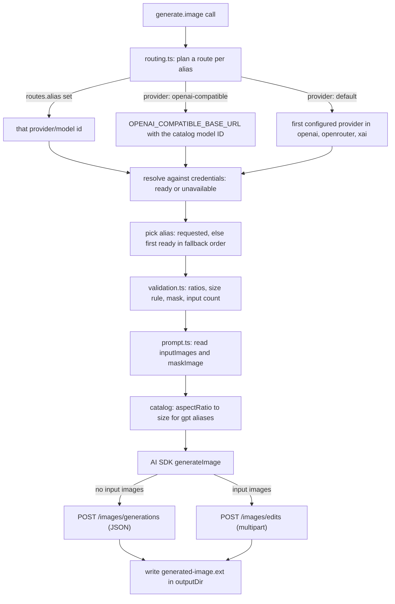

# Structured `generate.image` And Provider Routing

`generate.image` is the fork's structured image tool: a prompt, a Lilac model
alias, optional dimensions, optional input images and a mask, and an output
directory. Upstream replaced it with a script runner; the fork keeps the
structured contract (see [`fork-differences.md`](./fork-differences.md)) and
lets operators route aliases: a bulk `provider` for every alias, plus
per-alias `<provider>/<model id>` routes, including one OpenAI-compatible
endpoint.

This document covers how the tool is put together, how requests flow, and how
to configure and troubleshoot routing. Routing changes the request destination
only: aliases, input validation, image editing, and output handling stay the
same.

## How it works

Everything specific to the tool lives in fork-owned modules so upstream merges
stay mechanical:

| Module | Owns |
| --- | --- |
| `apps/core/src/tool-server/tools/generate-image/catalog.ts` | One capability entry per alias: upstream model ID per provider, accepted aspect ratios, the size rule, mask support, and input-image limits; the fallback order; ratio-to-size mapping |
| `.../generate-image/validation.ts` | Checks a request against the alias's catalog entry before any HTTP request |
| `.../generate-image/input.ts` | The zod input schema; the `size` and `aspectRatio` help text is generated from the catalog |
| `.../generate-image/routing.ts` | Plans a route per alias from the config, resolves it against the environment, and picks the alias for a call |
| `.../generate-image/prompt.ts` | Reads input images and the mask into the AI SDK prompt shape |
| `.../generate-image/callable.ts` | The Level 2 callable: resolve, pick, validate, generate, write the file |
| `packages/utils/openai-compatible-image-provider.ts` | The image client for the OpenAI-compatible endpoint |
| `packages/utils/core-config/generate-image.ts` | The alias list (the config contract), the route grammar, and the `tools.generate` schema |

The catalog is the single source of truth. Adding an alias means adding it to
`IMAGE_GENERATION_MODEL_ALIASES` in `packages/utils/core-config/generate-image.ts`
(so `models` and `routes` accept it) and adding one catalog entry; TypeScript
rejects a catalog that misses an alias, and a drift test pins the fallback
order to the alias list. `tools/generate.ts` upstream-side only registers the
callable and exports a few shared helpers.

### Request flow



Every route shares every step except the model construction and the request
options. A validation failure is a `usage` error naming the alias and is
returned before any HTTP request. An alias whose route lacks credentials is
still advertised, and a call that requests it (or falls back onto it) fails
with a `usage` error naming the missing environment variable.

### Routes

For each alias, in this order:

1. `tools.generate.image.routes.<alias>`, when set, names the provider and the
   model ID exactly.
2. Otherwise `tools.generate.image.provider` decides: `openai-compatible` sends
   the alias to the compatible endpoint with its catalog model ID (see
   [Model aliases](#model-aliases)); `default` uses the built-in preference.
3. The built-in preference is the first provider in the order `openai`,
   `openrouter`, `xai` that both has credentials in the environment and has a
   model ID for that alias in the catalog. An alias with no serviceable
   provider is not advertised.

`tools.generate.image.models`, when present, limits which aliases exist at all.
The tool catalog lists the advertised aliases in fallback order.

### OpenAI-compatible route

Aliases routed to `openai-compatible` (by the bulk `provider` or a per-alias
route) are served by one client built for `OPENAI_COMPATIBLE_BASE_URL` and
`OPENAI_COMPATIBLE_API_KEY`. The client is built by the fork for image traffic
and differs from the shared chat provider in one way: multipart uploads to
`/images/edits` carry filenames (`image.png`, `mask.png`, ...). Bun serializes
unnamed blobs with `filename=""`, which OpenAI-style endpoints reject, and the
AI SDK's compatible provider does not name them. The official OpenAI provider
receives the same fix from upstream.

The compatible route sends exactly one attempt per call. No route falls back to
another provider.

## Requirements

An OpenAI-compatible endpoint must implement:

- `POST /images/generations` for image generation
- `POST /images/edits` for image editing and masks

The configured base URL is prepended to those paths. For example, a base URL of
`https://provider.example.com/v1` results in requests to
`https://provider.example.com/v1/images/generations`.

The endpoint must accept the model IDs Lilac sends. By default these are the
IDs listed in [Model aliases](#model-aliases); use `routes` to send a
different ID for individual aliases.

## Configuration

Routing requires a v2 `core-config.yaml`. Set the fields in
`$DATA_DIR/core-config.yaml`; `DATA_DIR` defaults to the repository's `data/`
directory.

Route every alias to the compatible endpoint:

```yaml
configVersion: 2

tools:
  generate:
    image:
      provider: openai-compatible
```

Restrict the served aliases and route individual aliases elsewhere or under a
different model ID:

```yaml
tools:
  generate:
    image:
      provider: openai-compatible
      # Optional allowlist of Lilac aliases to advertise and serve.
      # Omitted = every alias whose route is serviceable.
      models: [nanobanana-2, gpt-image-2, grok-imagine-image]
      # Optional per-alias routes as "<provider>/<model id>".
      # provider: openai | openrouter | xai | openai-compatible
      routes:
        nanobanana-2: openai-compatible/gemini-3.1-flash-image-preview
        gpt-image-2: openai/gpt-image-2
        grok-imagine-image: xai/grok-imagine-image
```

The model ID is everything after the first slash, so OpenRouter slugs work as
`openrouter/openai/gpt-image-2`. Unknown aliases, unknown providers, and values
without a slash are rejected at config parse time.

Set the compatible endpoint and API key in the environment of the core runtime
or standalone tool bridge:

```dotenv
OPENAI_COMPATIBLE_BASE_URL=https://provider.example.com/v1
OPENAI_COMPATIBLE_API_KEY=replace-with-your-api-key
```

Routes to `openai`, `openrouter`, and `xai` use the provider's usual variables
(`OPENAI_API_KEY`/`OPENAI_BASE_URL`, `OPENROUTER_API_KEY`/`OPENROUTER_BASE_URL`,
`XAI_API_KEY`/`XAI_BASE_URL`).

The API key is sent as an `Authorization: Bearer` header. Each endpoint is an
operator-controlled trust boundary: image prompts, source images, and masks are
sent to it when `generate.image` is called.

The config is read on every call, so a `core-config.yaml` change applies
without a restart. Restart the runtime or standalone tool bridge after changing
environment variables.

### Migrating from `openaiCompatible`

Earlier fork versions nested the allowlist and model-ID overrides under
`tools.generate.image.openaiCompatible`. That block is now rejected with a
message naming the replacement:

```yaml
# before
tools:
  generate:
    image:
      provider: openai-compatible
      openaiCompatible:
        models: [nanobanana-2]
        modelIds:
          nanobanana-2: gemini-3.1-flash-image-preview

# after
tools:
  generate:
    image:
      provider: openai-compatible
      models: [nanobanana-2]
      routes:
        nanobanana-2: openai-compatible/gemini-3.1-flash-image-preview
```

## Model aliases

Callers continue to use Lilac's existing aliases. On the OpenAI-compatible
route without an explicit `routes` entry, Lilac sends the alias's first
upstream model ID from the catalog, in the provider order `openai`,
`openrouter`, `xai`:

| Lilac alias | Default model ID sent upstream | Taken from |
| --- | --- | --- |
| `gpt-image-2` | `gpt-image-2` | openai |
| `gpt-5-image` | `gpt-image-1.5` | openai |
| `nanobanana` | `google/gemini-2.5-flash-image` | openrouter |
| `nanobanana-2` | `google/gemini-3.1-flash-image-preview` | openrouter |
| `nanobanana-2-lite` | `google/gemini-3.1-flash-lite-image` | openrouter |
| `nanobanana-pro` | `google/gemini-3-pro-image-preview` | openrouter |
| `grok-imagine-image` | `grok-imagine-image` | xai |
| `grok-imagine-image-pro` | `grok-imagine-image-pro` | xai |

A `routes` entry replaces both the provider and the model ID for that alias.
For example, `routes: { nanobanana-2: openai-compatible/gemini-3.1-flash-image-preview }`
sends `gemini-3.1-flash-image-preview` (without the `google/` prefix) whenever
a caller selects `nanobanana-2`.

`models` declares which aliases exist. When present, the tool catalog
advertises only those aliases, the default fallback picks only among them, and
requesting any other alias fails before an HTTP request is sent. When omitted,
every alias is eligible, and the catalog advertises the serviceable ones: on the
`default` route an alias needs a configured provider, while explicit routes and
the bulk `openai-compatible` route are advertised even when their credentials
are missing (see [Routes](#routes)).

## Start the standalone tool server

Build and start the standalone tool bridge:

```bash
cd apps/tool-bridge
bun run build
bun index.ts
```

In another terminal, list the available tools and aliases:

```bash
./apps/tool-bridge/dist/index.js --list
```

Use `TOOL_SERVER_BACKEND_URL` when the bridge listens on a non-default address:

```bash
TOOL_SERVER_BACKEND_URL=http://127.0.0.1:42069 \
  ./apps/tool-bridge/dist/index.js --list
```

## Generate an image

```bash
./apps/tool-bridge/dist/index.js generate.image \
  --prompt="A rainy Taipei street at night" \
  --model=gpt-5-image \
  --size=1024x1024 \
  --output-dir=./output \
  --output=json
```

The command writes the generated image to the output directory and returns its
path, byte count, MIME type, requested Lilac alias, provider warnings, and the
aggregated provider metadata (`providerMetadata`, for
example `{ "openai": { "images": [{ "revisedPrompt": "..." }] } }`; an empty
object when the provider reports none).

The tool builds this aggregate from the SDK's per-call metadata. It concatenates
non-gateway providers' image entries and sums gateway cost fields as decimal strings,
preserving precision and the existing result shape when generation spans multiple
provider calls.

When an agent uses an OpenAI-compatible chat model, tool-returned images are
forwarded in a user image message after the complete tool reply group, with
labels identifying the originating tool and call. This changes only the model
input view; the canonical transcript remains unchanged. Image recognition still
depends on the selected endpoint and model supporting vision.

Alias-specific validation still applies. For example, unsupported GPT image
sizes and unsupported Grok mask combinations are rejected before an HTTP
request is sent. `tools --help generate.image` prints the accepted ratios and
size rules per alias; that text is generated from the catalog.

## Edit an image

For structured inputs such as source images and masks, use a JSON input file:

```json
{
  "prompt": "Replace the background with a mountain lake",
  "model": "gpt-5-image",
  "inputImages": ["./input.png"],
  "maskImage": "./mask.png",
  "outputDir": "./output"
}
```

Run it with:

```bash
./apps/tool-bridge/dist/index.js generate.image --input=@edit-image.json --output=json
```

Lilac sends edits as multipart requests to `/images/edits` with named parts
(`image`, `mask`). The provider must support the selected model and edit
operation.

## Default routing

To restore the built-in provider-aware routing for every alias, set:

```yaml
tools:
  generate:
    image:
      provider: default
```

Omitting the field also defaults to `default`. In that mode, aliases without a
`routes` entry use the built-in preference described in [Routes](#routes).

## Errors and fallback behavior

- If an alias is routed to `openai-compatible` but `OPENAI_COMPATIBLE_BASE_URL`
  is missing, the alias stays advertised, but a `generate.image` call that
  selects it fails before sending an HTTP request. With `provider:
  openai-compatible` and no base URL, every call fails this way.
- An explicit route to `openai`, `openrouter`, or `xai` without credentials
  behaves the same and names the missing variable.
- Provider HTTP errors and malformed responses are returned to the caller.
- The compatible route sends one generation attempt; other providers keep the
  AI SDK's default retries.
- No route falls back to another provider.
- `generate.video` remains independent of these settings.

## Aspect ratio forwarding

The OpenAI-compatible image API has no dedicated aspect-ratio parameter. For
the ratio-driven aliases (`nanobanana*` and `grok-imagine-image*`) on the
compatible route, Lilac validates `aspectRatio` against the alias and then
forwards it as a colon-form `size` value on the wire, e.g. `"size": "16:9"`.
No `unsupported: aspectRatio` warning is produced.

How gateways handle the colon-form `size`:

- new-api maps a `size` containing a colon to Gemini's `aspectRatio` for
  Gemini image models, so `nanobanana*` aliases produce the requested ratio.
- xAI's image API has no size parameter, so grok-via-gateway ignores the value
  and `grok-imagine-image*` behaves as it does today.
- Gateways that reject non-WxH `size` values fail loudly with a provider
  error rather than silently producing the wrong ratio.

For `gpt-image-2` and `gpt-5-image`, Lilac converts `aspectRatio` into an
equivalent WxH `size` before the request on every route, so those aliases never
send a colon-form `size`.

## Troubleshooting

### The provider returns model-not-found

Confirm that the provider recognizes the model ID Lilac sends: the default
ID from the alias table, or the `routes` entry when one is configured. If the
provider expects a different ID for an alias (for example
`gemini-3.1-flash-image-preview` without the `google/` prefix), set a route
for it. If the provider serves only some aliases, list them in `models` so
unavailable aliases are not advertised or selected.

### The request returns 404

Check whether the base URL includes the provider's API version prefix, usually
`/v1`. Lilac appends `/images/generations` or `/images/edits` to the configured
base URL.

### Image generation is not using the third-party endpoint

Confirm all of the following:

1. `core-config.yaml` has `configVersion: 2`.
2. `tools.generate.image.provider` is `openai-compatible`, or the alias has a
   `routes` entry starting with `openai-compatible/`.
3. The runtime process received `OPENAI_COMPATIBLE_BASE_URL` and
   `OPENAI_COMPATIBLE_API_KEY`.
4. The runtime was restarted after changing its environment.

### Image generation fails but video generation still appears

This is expected when the OpenAI-compatible image endpoint is missing or
invalid. Image routing does not control `generate.video`.
