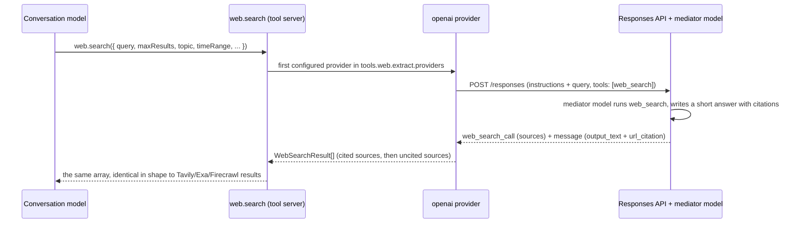

# OpenAI Web Search Provider

`openai` is a `web.search` provider that runs the OpenAI Responses API hosted
`web_search` tool. It is a fork-only feature (see
[`fork-differences.md`](./fork-differences.md)).

The one thing to understand before enabling it: OpenAI exposes `web_search`
only as a tool inside a Responses model call, not as a standalone search API.
The provider therefore runs a **separate mediator model** for every search.
The conversation model that called `web.search` is unchanged; it decides when
to search, what the query is, and what to do with the results. The mediator
only executes the hosted search and produces citations. This document spells
out exactly what crosses each boundary.

## How a search flows



If the provider fails with a retriable error (rate limit, 5xx, timeout, network
error), `web.search` continues with the next provider in the list, exactly as
for the other providers.

## What the mediator model receives

One non-streaming `POST {baseUrl}/responses` with this body:

```jsonc
{
  "model": "<model id from tools.web.openai.model>",
  "input": "<instructions, see below>",
  "tools": [{ "type": "web_search", "search_context_size": "low | medium | high" }],
  "tool_choice": "required",            // the hosted search is the only tool, so this forces a real search
  "include": ["web_search_call.action.sources"],
  "store": false
}
```

`input` is plain text built from the `web.search` arguments. Lines in brackets
appear only when the corresponding argument is set:

```text
Search the web for the query below and answer it briefly.
Cite every source you rely on, and use up to {maxResults} distinct sources.
[Prefer recent news coverage.]                                  topic: news
[Prefer financial and market sources.]                          topic: finance
[Only rely on sources published within the last week.]          timeRange: week (day/month/year likewise)
[Only rely on sources published between {startDate} and {endDate}.]
[Only rely on sources published on or after {startDate}.]
[Only rely on sources published on or before {endDate}.]

Query: {query}
```

That is the mediator's entire world. It does **not** receive:

- the conversation history, the system prompt, or the user's original message;
- any other tool, so it cannot read pages, call `web.extract`, or ask follow-ups;
- `searchDepth`, which has no equivalent in the hosted tool and is ignored.

Because the time and topic constraints are instructions to a model, they are
guidance rather than enforced filters. A result outside the requested window
can still appear.

## What OpenAI returns to the provider

The completed response contains two kinds of output items:

- `web_search_call`: the hosted search itself, with `action.sources` listing
  every URL the search retrieved (requested through `include`).
- `message`: the mediator's short answer as `output_text`, with `url_citation`
  annotations. Each annotation carries `url`, `title`, and the
  `start_index`/`end_index` of the citation marker inside the answer text.

Responses whose status is `failed`, `cancelled`, or `incomplete`, API error
envelopes, non-JSON bodies, and completed responses without a `web_search_call`
item are all rejected with an error that keeps the HTTP status (see
[Errors](#errors-and-fallback)).

## What the conversation model receives

`web.search` returns the provider's `WebSearchResult[]` unchanged. Every entry
is `{ url, title, content, score }` with `score` always `null`. The array is
built in this order:

1. **Cited sources**, in the order they appear in the mediator's answer.
   - `url`: the cited URL with the `utm_source=openai` tag removed.
   - `title`: the citation title, or the URL when the title is missing.
   - `content`: the paragraph of the mediator's answer that the citation
     supports, with the inline `([site](url))` markers removed, cut at 600
     characters, and prefixed with
     `OpenAI-generated summary (may combine cited sources): `. When the
     annotation has no position information, `content` is an empty string.
2. **Uncited sources** from `web_search_call.action.sources`, appended after
   the citations. `title` is the URL and `content` is empty.

Duplicates are removed by URL (a cited URL wins over the same uncited URL), and
the list is cut to `maxResults`.

A real result for the query `Bun 1.3 release notes` with `maxResults: 3`
looked like this:

```json
[
  {
    "url": "https://bun.com/blog/bun-v1.3",
    "title": "Bun 1.3 | Bun Blog",
    "content": "OpenAI-generated summary (may combine cited sources): Summary — Bun v1.3 (released Oct 10, 2025) - Major “full‑stack” re...",
    "score": null
  },
  {
    "url": "https://github.com/oven-sh/bun/releases",
    "title": "Releases: oven-sh/bun - GitHub",
    "content": "OpenAI-generated summary (may combine cited sources): Also listed on the project releases page on GitHub.",
    "score": null
  },
  { "url": "https://bun.com/blog/bun-v1.3.13", "title": "https://bun.com/blog/bun-v1.3.13", "content": "", "score": null }
]
```

The conversation model does **not** receive:

- the mediator's full answer (only the paragraphs attached to citations
  survive, as `content`);
- the search terms the mediator actually issued (`action.query`);
- titles or text for uncited sources, or any page text at all;
- which provider produced the array, or the mediator's token usage and cost.

In other words, `content` from this provider is a second-hand summary written
by a model that saw one line of query, not an excerpt of the page. The label
makes that visible to the conversation model. Tavily, Exa, and Firecrawl fill
`content` with page excerpts instead.

## Configuration

Requires `configVersion: 2`. Frozen v1 configurations cannot select this
provider.

```yaml
configVersion: 2

tools:
  web:
    extract:
      providers: [tavily, openai]   # ordered fallback chain; openai runs only when listed
    openai:
      model: openai-compatible/gpt-5.6-terra   # provider/model that runs the hosted search
      searchContextSize: medium                # low | medium | high
```

| Field | Default | Meaning |
| --- | --- | --- |
| `tools.web.extract.providers` | `[tavily]` | Ordered provider chain for `web.search` and provider-assisted `web.extract`. `openai` is search-only. |
| `tools.web.openai.model` | `openai/gpt-5-mini` | The mediator model as `provider/model`. `openai/<id>` uses `OPENAI_API_KEY` and `OPENAI_BASE_URL`; `openai-compatible/<id>` uses `OPENAI_COMPATIBLE_API_KEY` and `OPENAI_COMPATIBLE_BASE_URL`. A bare model id from an older config means `openai/<id>`. Any other provider (for example `anthropic/...`) leaves the `openai` provider unconfigured and logs the reason. |
| `tools.web.openai.searchContextSize` | `medium` | Passed to the hosted tool as `search_context_size`; controls how much retrieved text the mediator sees. |

Credentials never live in `core-config.yaml`. When the base URL points at an
OpenAI-compatible gateway, that gateway must relay `POST /responses` with the
hosted `web_search` tool; a gateway that only proxies chat completions returns a
4xx that surfaces as a provider failure.

Because `web.extract` skips search-only providers, keep `tavily`, `exa`, or
`firecrawl` in the list when the agent needs page extraction. With `openai` as
the only provider, `web.extract` reports:
`web.extract is unavailable: configured providers are search-only (openai); add tavily, exa, or firecrawl.`

## Errors and fallback

| Situation | Behavior |
| --- | --- |
| `tools.web.openai.model` resolves to an unsupported provider, or an `openai-compatible` model lacks `OPENAI_COMPATIBLE_BASE_URL` or `OPENAI_COMPATIBLE_API_KEY` | The `openai` provider is left unconfigured; Core logs `web.search provider 'openai' is unavailable: tools.web.openai.model cannot run web_search` with the reason. Other providers in the chain still run. |
| No API key for the resolved endpoint and `openai` is the only provider | `web.search is unavailable: OPENAI_API_KEY is not configured (set env var OPENAI_API_KEY, or OPENAI_COMPATIBLE_API_KEY when tools.web.openai.model is an openai-compatible model).` |
| HTTP error from the endpoint | `OpenAI web search failed (<status>): <API error message>`; the status is preserved so rate limits and server errors fall through to the next provider. |
| Response status `failed`, `cancelled`, or `incomplete` | `OpenAI web search failed (<status>): response status '<status>'` or `response incomplete (<reason>)`; not retried on this provider. |
| Body is not JSON, or does not match the expected shape | `OpenAI web search failed (<status>): invalid JSON response.` / `invalid response contract.` |

## Limitations

- Results are mediated: snippets are summaries by the configured model, not
  page excerpts, and the mediator has no conversation context.
- Each search is one extra model call. Expect roughly 15–20 seconds and the
  mediator's token cost on top of the hosted search fee.
- Date and topic constraints are prompt guidance, not filters. `searchDepth`
  is ignored.
- Search only; `web.extract` never uses this provider.
- Only `openai` and `openai-compatible` models can run the hosted tool. Models
  from other providers cannot be used as the mediator.
- The conversation model never gets OpenAI's hosted tools attached to its own
  request; the provider is the only path to `web_search` in Lilac today.

## Verifying a deployment

The provider class can be exercised directly with the deployment's own
environment. Run this inside the Core container (or from a source checkout
with the same variables exported); it prints result titles and URLs only.

```bash
bun -e '
import { OpenAIWebSearchProvider } from "/app/apps/core/src/tool-server/tools/web-search/openai-web-search-provider.ts";
const p = new OpenAIWebSearchProvider({
  apiKey: process.env.OPENAI_API_KEY,
  baseUrl: process.env.OPENAI_BASE_URL,
  model: "gpt-5-mini",
  searchContextSize: "low",
});
const results = await p.search(
  { query: "Bun 1.3 release notes", topic: "general", searchDepth: "auto", maxResults: 3 },
  { signal: AbortSignal.timeout(90000) },
);
for (const r of results) console.log(r.title, "|", r.url, "|", r.content.slice(0, 80));
'
```

Use the `OPENAI_COMPATIBLE_*` variables instead when `tools.web.openai.model`
names an `openai-compatible/...` model. Use a source checkout path instead of
`/app` outside the container.

## Related

- [`core-config-migrations.md`](./core-config-migrations.md): the `tools.web.openai` fields
- [`fork-differences.md`](./fork-differences.md): status, limitations, and the Fork Code Layout row
- `apps/core/src/tool-server/tools/web-search/openai-web-search-provider.ts`: request, decoding, and result mapping
- `apps/core/src/tool-server/tools/web-search/openai-web-search-model.ts`: `tools.web.openai.model` resolution
