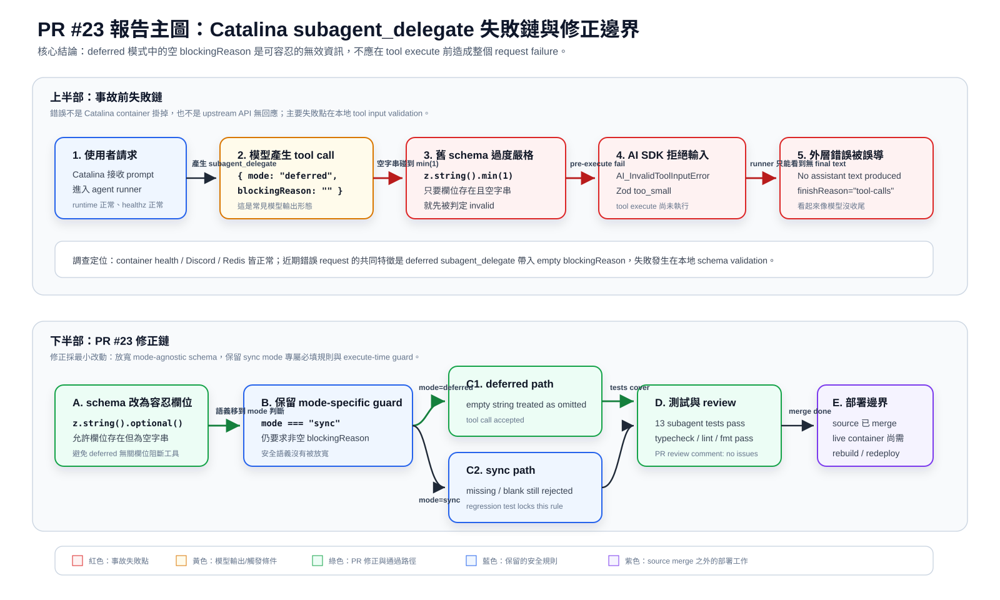
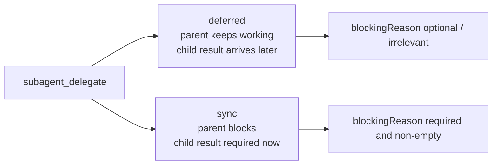
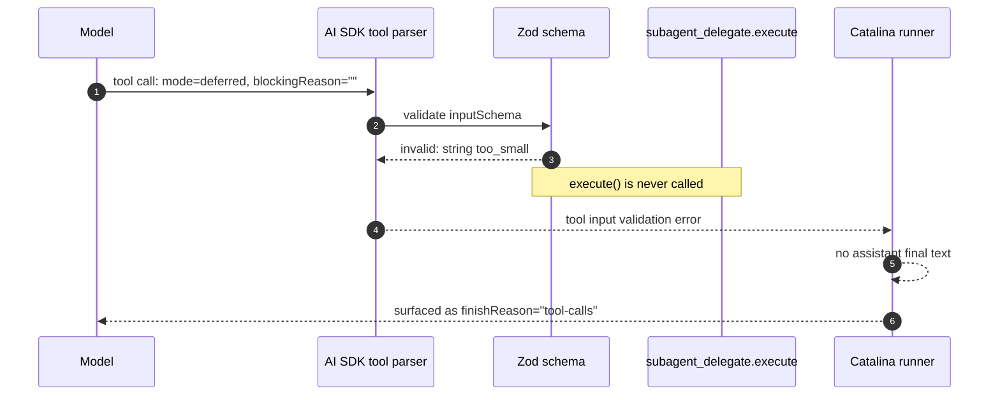
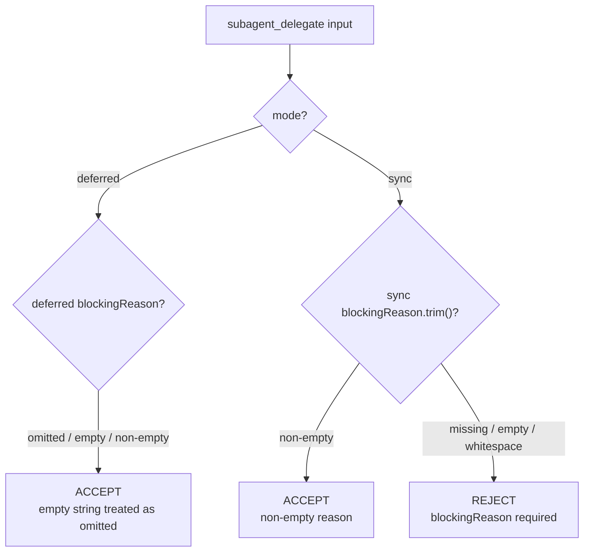
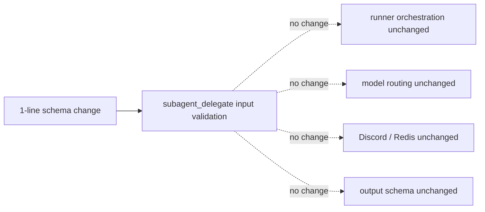
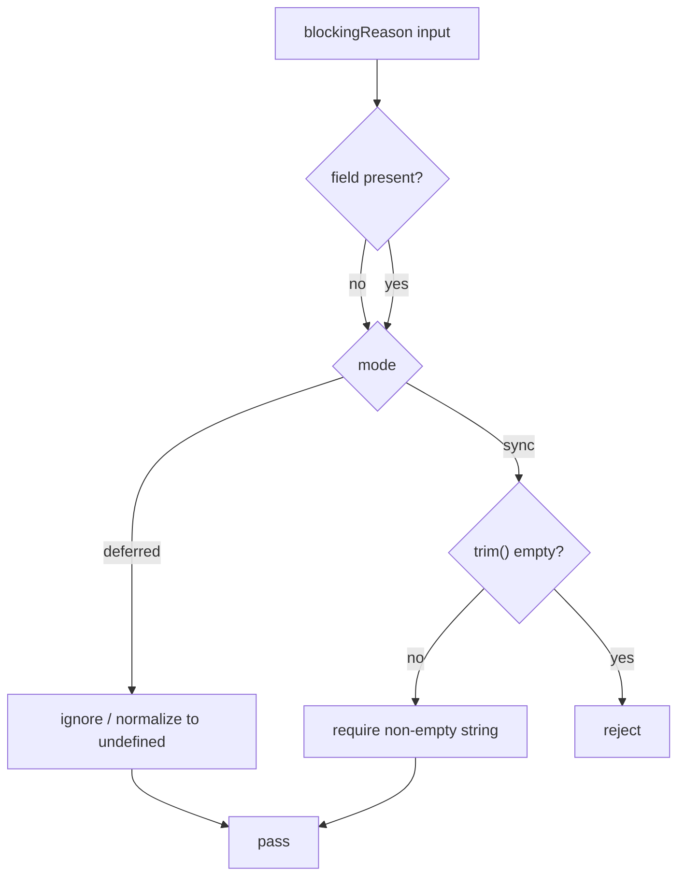
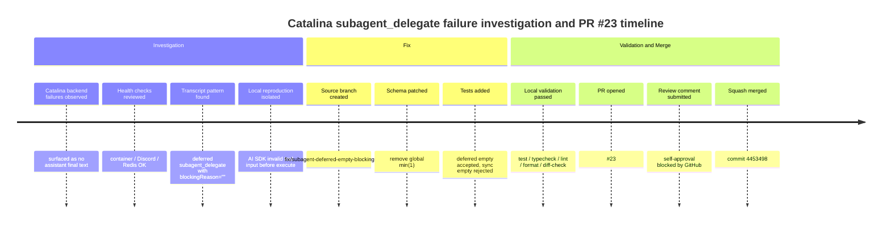

# PR #23 完整報告書：Catalina `subagent_delegate` deferred 空 `blockingReason` 修正

> 報告日期：2026-07-06
> 目標 PR：<https://github.com/DF-wu/lilac-mono/pull/23>
> Merge commit：`445349817fa22671b85a07dee8ac25e021923262`
> 報告範圍：Catalina backend fail 的前因後果、root cause、PR #23 修正設計、測試驗證、review/merge 流程、部署影響與後續觀測建議。

## 1. 摘要結論

PR #23 是一個非常小但定位精準的 source fix。它處理的是 Catalina backend 在 `subagent_delegate` tool call 上出現的本地 validation failure：模型在 deferred 模式下送出 `blockingReason: ""`，而舊 schema 對任何存在的 `blockingReason` 都套用 `.min(1)`，導致 tool input 還沒有進入 `execute` 就被 AI SDK / Zod 判成 invalid。

這個錯誤的表象是：

```text
No assistant text was produced ... finishReason='tool-calls'
```

但真正原因不是 container 掛掉、不是 Discord/Redis 壞掉，也不是 upstream/new-api 不通。真正原因是本地 `subagent_delegate` input schema 把「只應該在 sync mode 生效的非空規則」錯放到「所有 mode 都生效的欄位型別規則」上。

PR #23 的核心改動：

```diff
blockingReason: z
  .string()
- .min(1)
  .optional()
```

這讓 `mode: "deferred", blockingReason: ""` 可以通過 schema，並在既有 runtime normalization 中被視為 omitted。同時，PR 沒有放寬 sync 的安全規則，因為 sync 專屬的 `superRefine` 和 execute-time guard 仍會拒絕 missing 或 blank `blockingReason`。

最重要的語義判斷是：

| 情境 | `blockingReason: ""` 是否合理 | PR #23 後行為 | 理由 |
| --- | --- | --- | --- |
| `mode: "deferred"` | 可容忍，應視同 omitted | Accepted | deferred 不 blocking parent，本來就沒有 blocking reason |
| `mode: "sync"` | 不合理，必須拒絕 | Rejected | sync 代表 parent 要等 child，必須說明為什麼需要 blocking |

## 2. 主圖：失敗鏈與修正邊界

下圖是本報告的主圖，分成上半部事故前失敗鏈與下半部 PR #23 修正鏈。



圖表重點：

1. 上半部紅色節點是事故失敗點：舊 schema 的 `.min(1)` 讓 deferred mode 的空字串 `blockingReason` 在 tool execute 前失敗。
2. 黃色節點是觸發條件：模型輸出 `mode="deferred"` 並同時帶 `blockingReason=""`。這不是有用資訊，但在 LLM tool calling 中是常見且應容忍的輸出形態。
3. 下半部綠色節點是 PR #23 修正：schema 接受 optional string，實際必填規則交給 mode-specific guard。
4. 藍色節點是保留的安全規則：sync mode 的 `blockingReason` 仍必須非空。
5. 紫色節點是部署邊界：source 已 merge，不等於 live Catalina container 已套用，仍需要 rebuild/redeploy。

## 3. PR metadata

| 項目 | 內容 |
| --- | --- |
| PR | <https://github.com/DF-wu/lilac-mono/pull/23> |
| Title | `fix: accept empty deferred subagent blocking reason` |
| Head branch | `fix/subagent-deferred-empty-blocking-reason` |
| Base branch | `feat/image-provider-base-url` |
| Merge method | Squash merge |
| Merge SHA | `445349817fa22671b85a07dee8ac25e021923262` |
| PR head SHA | `428149cd301bcddaf9677c6242d0c011ba20b442` |
| Changed files | 2 |
| Source diff | 1 deletion |
| Test diff | 67 insertions |
| Merged at | 2026-07-06 02:56:46 +0800 |

Changed files:

| File | Purpose |
| --- | --- |
| [`apps/core/src/tools/subagent.ts`](../apps/core/src/tools/subagent.ts) | 修正 `blockingReason` schema，把非空規則從 mode-agnostic 欄位型別移回 sync-only validation |
| [`apps/core/tests/tools/subagent.test.ts`](../apps/core/tests/tools/subagent.test.ts) | 新增 deferred empty-string regression test，並補強 sync blank-string reject test |

## 4. 前因：Catalina backend 為什麼看起來一直 fail

### 4.1 使用者可見症狀

Catalina backend 的失敗表象集中在 agent response 沒有產生可用 final text，並出現類似下列錯誤：

```text
No assistant text was produced ... finishReason='tool-calls'
```

這類錯誤容易誤導調查方向，因為它看起來像模型一直停在 tool-calling 狀態，沒有回到 final answer。實際上，這只是外層 runner 看到的結果；真正的下游錯誤在 tool input validation。

### 4.2 初始可能原因

調查時合理的候選原因包括：

| 候選原因 | 可能性 | 調查結果 | 是否 root cause |
| --- | --- | --- | --- |
| Catalina container crash / restart | 中 | container healthy，`/healthz` OK，無 restart/OOM 證據 | 否 |
| Discord adapter 或 Redis 異常 | 中 | health checks 顯示 Discord ready、Redis OK | 否 |
| new-api/upstream 模型不可用 | 中 | 同時間 upstream 多數 OK；錯誤可在本地 schema reproduced | 否 |
| 模型無法產生 final answer | 中 | 表象吻合，但深層原因是 tool input invalid | 否 |
| `subagent_delegate` schema 過度嚴格 | 高 | 與 transcript tool call、Zod error、isolated reproduction 全部吻合 | 是 |

### 4.3 失敗集中模式

近期錯誤 request 的共同特徵是模型呼叫：

```json
{
  "mode": "deferred",
  "blockingReason": ""
}
```

這個 payload 的語義很關鍵：

1. `mode: "deferred"` 表示 parent 不需要立刻等 child result。
2. deferred work 沒有 blocking reason。
3. `blockingReason: ""` 是模型多填了一個沒有資訊量的欄位。
4. 正確系統行為應該是忽略或視同 omitted，而不是讓整個 tool call invalid。

## 5. `subagent_delegate` 的語義背景

`subagent_delegate` 支援兩種 delegation mode：



### 5.1 deferred mode

deferred mode 的 contract 是：

- child subagent 立即開始；
- tool 回傳 accepted handle；
- parent 可以繼續工作；
- child result 之後會自動插入為 synthetic tool result；
- parent 不應 poll 或手動 join deferred child；
- 因為 parent 沒有被 child result 卡住，所以不需要 `blockingReason`。

因此 deferred mode 中的 `blockingReason` 有三種可能：

| 輸入形態 | 語義 | 應有行為 |
| --- | --- | --- |
| omitted | 正常 | accepted |
| `""` | 無資訊量，等同 omitted | accepted |
| non-empty string | 多餘但不危險 | accepted 或忽略 |

PR #23 處理的是第二種：`""` 不該導致 invalid tool input。

### 5.2 sync mode

sync mode 的 contract 是：

- parent 要等 child 完成；
- child result 會決定下一步；
- 這會消耗等待時間與 orchestration 資源；
- 因此必須要求模型說明為什麼這個 child result 是「立即必要」。

sync mode 中 `blockingReason` 的正確行為：

| 輸入形態 | 語義 | 應有行為 |
| --- | --- | --- |
| omitted | 沒有說明為什麼要 blocking | reject |
| `""` | 空說明，等同沒有說明 | reject |
| whitespace only | 空說明 | reject |
| non-empty string | 有明確 blocking reason | accepted |

PR #23 沒有放寬 sync mode。這點由測試鎖住。

## 6. Root cause：`optional()` 與 `.min(1)` 的組合位置錯誤

舊 schema：

```ts
blockingReason: z
  .string()
  .min(1)
  .optional()
  .describe(
    'Required when mode is "sync". Explain why the child result is immediately required before continuing.',
  ),
```

這段程式的問題不是 `.optional()`，也不是 `.min(1)` 個別錯，而是兩者組合後的位置語義錯了。

Zod 的 `optional()` 只表示 `undefined` 可以通過。它不表示空字串可以通過。當欄位存在時，仍會先執行 `z.string().min(1)`。所以：

| Input | 舊 schema 結果 | 原因 |
| --- | --- | --- |
| `blockingReason` omitted | pass | `optional()` 接受 `undefined` |
| `blockingReason: "need result"` | pass | string 長度 >= 1 |
| `blockingReason: ""` | fail | 欄位存在，`.min(1)` 失敗 |

但實際 contract 是「只有 sync mode 才要求 non-empty」。舊 schema 把 non-empty 規則套到所有 mode 上，導致 deferred mode 被錯誤拒絕。

### 6.1 失敗位置圖



重點是第 4 步：`execute()` 根本沒有執行。這也解釋了為什麼只看 runner final error 會很難定位，因為真正錯誤比 execute-time log 更早發生。

## 7. PR #23 的修正設計

### 7.1 修正前後對照

修正前：

```ts
blockingReason: z
  .string()
  .min(1)
  .optional()
```

修正後：

```ts
blockingReason: z
  .string()
  .optional()
```

保留不變的 sync-only validation：

```ts
.superRefine((value, ctx) => {
  if (value.mode === "sync" && !value.blockingReason?.trim()) {
    ctx.addIssue({
      code: "custom",
      path: ["blockingReason"],
      message: 'blockingReason is required when mode is "sync"',
    });
  }
});
```

保留不變的 execute-time guard：

```ts
const blockingReason = parsed.blockingReason?.trim() || undefined;

if (mode === "sync" && !blockingReason) {
  throw new Error('blockingReason is required when mode is "sync"');
}
```

### 7.2 為什麼這是最小正確修正

PR #23 沒有改 runner、沒有改 tool orchestration、沒有改模型配置、沒有關閉 subagents。原因是這些都不是 root cause。

最小正確修正應滿足四個條件：

| 條件 | PR #23 是否滿足 | 說明 |
| --- | --- | --- |
| 解掉 observed failure | 是 | deferred empty string 不再被 `.min(1)` 擋掉 |
| 不放寬 sync safety | 是 | sync blank/missing 仍由 `superRefine` 與 execute guard 擋掉 |
| 不改變 tool contract | 是 | contract 本來就是 only sync requires `blockingReason` |
| 不擴大 blast radius | 是 | source 只刪 1 行 schema constraint，測試新增覆蓋 |

### 7.3 為什麼不是把 prompt 改嚴格就好

Prompt workaround 可以要求模型在 deferred mode omit `blockingReason`，但這只是降低發生率，不是修正系統契約。

理由：

1. LLM tool calling 常會對 optional 欄位輸出空字串。
2. prompt 無法保證所有模型、所有 provider、所有 decode 情境都遵守。
3. schema 應該接受 contract 允許的輸入，而 deferred empty `blockingReason` 在語義上等同 omitted。
4. 依靠 prompt 會讓 production reliability 取決於模型行為，而不是 deterministic validation。

### 7.4 為什麼不是關閉 subagents

關閉 subagents 或把 `maxDepth` 設為 0 可以立即降低錯誤，但代價是移除並行探索能力。那是 operational mitigation，不是 root fix。

| 方案 | 可立即止血 | 根治 | 代價 | 評估 |
| --- | --- | --- | --- | --- |
| 關閉 subagents | 是 | 否 | 失去 subagent parallelism | 適合 emergency mitigation |
| Prompt workaround | 部分 | 否 | 依賴模型遵守 | 不可靠 |
| 換模型 / 換 route | 不穩定 | 否 | 可能換掉其他行為 | root cause 不在 provider |
| PR #23 source fix | 是，需 deploy | 是 | 極小 | 最合理 |

## 8. Regression tests

PR #23 新增兩個關鍵測試行為。

### 8.1 deferred empty `blockingReason` accepted

新增測試：

```ts
it("treats an empty deferred blockingReason as omitted", async () => {
  // ...
  const res = await resolveExecuteResult(
    tools.subagent_delegate.execute!(
      {
        profile: "explore",
        task: "Map auth flow",
        mode: "deferred",
        blockingReason: "",
      },
      // context omitted
    ),
  );

  expect(res.status).toBe("accepted");
});
```

這個測試鎖住事故 payload：`mode: "deferred", blockingReason: ""` 必須 accepted。

它檢查兩件事：

1. schema 不再在 execute 前 reject；
2. deferred registration 邏輯仍正常執行，`launches` 有 child request/session/task。

### 8.2 sync blank `blockingReason` rejected

補強既有 sync validation test：

```ts
await expect(
  tools.subagent_delegate.execute!(
    { profile: "explore", task: "Map auth flow", mode: "sync", blockingReason: "" },
    // context omitted
  ),
).rejects.toThrow(/blockingReason is required/i);
```

這個測試確認 PR #23 不是把 `blockingReason` 整體放水，而是只修正 deferred 的容錯邊界。

### 8.3 行為矩陣



## 9. 驗證結果

PR merge 前已執行：

```bash
cd apps/core && bun test tests/tools/subagent.test.ts
cd apps/core && bunx tsc -p tsconfig.json --noEmit
bun run lint:fix
bun run fmt
git diff --check
cd apps/core && bun test tests/tools/subagent.test.ts
```

結果：

| 驗證項目 | 結果 |
| --- | --- |
| `tests/tools/subagent.test.ts` | 13 pass, 0 fail |
| `apps/core` typecheck | pass |
| `bun run lint:fix` | 0 warnings, 0 errors |
| `bun run fmt` | completed |
| `git diff --check` | pass |
| 格式化後 focused test 重跑 | 13 pass, 0 fail |

### 9.1 驗證涵蓋範圍

| 風險 | 對應驗證 |
| --- | --- |
| deferred empty string 仍被 reject | 新 regression test 直接覆蓋 |
| sync missing reason 被錯誤 accepted | 既有 test 覆蓋 |
| sync empty reason 被錯誤 accepted | 新增 assert 覆蓋 |
| TypeScript 型別破壞 | `bunx tsc -p tsconfig.json --noEmit` |
| lint/format 問題 | `lint:fix` + `fmt` |
| whitespace diff 問題 | `git diff --check` |

## 10. Review 與 merge 流程

PR 建立後做了 GitHub 端檢查：

| 檢查 | 結果 |
| --- | --- |
| PR mergeable state | clean |
| Changed files | 2 |
| Commit count | 1 |
| Remote check runs | none configured |
| Status checks | none configured |

Review 狀態：

1. 嘗試提交 approval review。
2. GitHub 拒絕，原因是 reviewer 與 PR author 是同一個帳號，不能 self-approve。
3. 改提交正式 PR review comment，內容記錄 no issues found、理由、驗證項目。
4. 在 PR clean mergeable 且本地驗證通過的前提下執行 squash merge。

Review comment：<https://github.com/DF-wu/lilac-mono/pull/23#pullrequestreview-4631818474>

## 11. 風險分析

### 11.1 功能風險

| 風險 | 等級 | 說明 | 緩解 |
| --- | --- | --- | --- |
| deferred 接受更多 `blockingReason` 值 | 低 | 欄位對 deferred 無語義作用，execute path 會 trim/normalize | regression test 覆蓋 empty string |
| sync blank reason 被接受 | 低 | `superRefine` 與 execute guard 都保留 | 新增 sync blank reject test |
| 其他工具 schema 受影響 | 極低 | 改動只在 `subagentDelegateInputSchema` | diff 僅 1 行 source |
| 模型仍產生其他 invalid fields | 中 | 本 PR 只處理已定位 root cause | 後續可觀測 transcript error pattern |

### 11.2 安全與行為語義

此 PR 沒有讓 sync 模式更容易被濫用。相反地，它把 validation 規則放回正確語義層：

- field type layer：`blockingReason` 可以是 optional string；
- semantic validation layer：只有 `mode === "sync"` 時要求 non-empty；
- runtime guard layer：execute-time 再確認 sync 不可 blank。

這是更正確的 layered validation。

### 11.3 Blast radius

Blast radius 很小：



## 12. Deployment 影響

PR #23 已 merge 到 source branch，但 live Catalina container 不會因 source merge 自動套用，除非部署流程會自動 rebuild/redeploy 這個 branch。

必要區分：

| 狀態 | 含義 |
| --- | --- |
| PR merged | GitHub source 已包含修正 |
| Local branch fast-forwarded | 本地 source 已同步到 merge commit |
| Image rebuilt | container image 才含有修正 |
| Catalina redeployed | live service 才實際吃到修正 |

因此如果 Catalina live 仍使用舊 image，錯誤仍可能繼續出現。

### 12.1 建議 post-deploy 驗證

部署後可以檢查：

```bash
rtk docker exec lilac-mono-catalina sh -lc 'curl -sS http://127.0.0.1:8080/healthz | jq "{ok, live, ready}"'
```

檢查近期 transcript 是否仍出現相同 signature：

```bash
rtk docker exec lilac-mono-catalina sh -lc 'sqlite3 /data/agent-transcripts.db "select request_id, datetime(updated_ts/1000, '\''unixepoch'\'', '\''localtime'\'') as updated_at, substr(final_text,1,220) from request_transcripts where updated_ts > (strftime('\''%s'\'', '\''now'\'', '\''-2 hours'\'') * 1000) and final_text like '\''Error:%'\'' order by updated_ts desc limit 20;"'
```

如果要專門確認 `blockingReason: ""` 不再造成 invalid input，需要觀察錯誤 transcript 中是否還有：

```json
{
  "toolName": "subagent_delegate",
  "input": {
    "mode": "deferred",
    "blockingReason": ""
  }
}
```

且 final error 是否仍是同一類 tool input validation failure。

## 13. 後續觀測建議

建議部署後觀測三個層級。

### 13.1 Request transcript level

目標：確認 `No assistant text produced ... finishReason='tool-calls'` 是否下降。

觀測點：

- `request_transcripts.final_text like 'Error:%'`
- tool call 是否包含 `subagent_delegate`
- input 是否仍有 deferred + empty `blockingReason`
- error 是否已不再是 Zod `too_small`

### 13.2 Tool failure logging level

目標：確認 invalid tool input 是否下降，且 subagent delegate 真正進入 execute。

觀測點：

- subagent delegate start log；
- deferred registration；
- synthetic tool result insertion；
- child request terminal status。

### 13.3 User-visible behavior level

目標：確認 Catalina 不再因 deferred subagent delegation 直接中斷。

觀測點：

- Discord final answer 是否正常出現；
- 長任務是否能先回 parent progress，再等 child result；
- 是否有新的 unrelated failure surfaced。

## 14. 替代方案比較

| 方案 | 優點 | 缺點 | 適用情境 | 最終判斷 |
| --- | --- | --- | --- | --- |
| Source fix：放寬 deferred empty `blockingReason` | 根治、符合 contract、風險小 | 需要 rebuild/redeploy | 正式修復 | 採用 |
| 關閉 subagents | 立即止血 | 犧牲 parallel delegation，沒有修 root cause | 緊急 mitigation | 不作為主解 |
| Prompt 要求 deferred omit `blockingReason` | 不需改 code | 不可靠，模型可能仍輸出空字串 | 短期輔助 | 不足 |
| 換模型或 route | 可能改變輸出分布 | root cause 仍存在，其他模型也可能踩到 | 模型品質調整 | 非 root fix |
| 在 runner 補救 invalid input | 可處理更多 malformed tool calls | 層級太外，容易吞掉 schema contract 問題 | 需大範圍容錯設計時 | 此 PR 不需要 |

## 15. 為什麼 `blockingReason: ""` 在 deferred 是正常的

更精確地說，它不是「有意義的正常值」，而是「在 deferred mode 下應該被容忍的無資訊量值」。

這個差異很重要：

- 不應把 `""` 當成有效 reason；
- 也不應因為 deferred 帶了 `""` 就讓 request fail；
- 正確處理是視同 omitted；
- sync mode 仍必須拒絕 `""`，因為 sync 需要真實 reason。

可以把它理解為以下 validation policy：



## 16. 程式碼層解釋

### 16.1 Source change

位置：[`apps/core/src/tools/subagent.ts`](../apps/core/src/tools/subagent.ts)

修正後 schema：

```ts
blockingReason: z
  .string()
  .optional()
  .describe(
    'Required when mode is "sync". Explain why the child result is immediately required before continuing.',
  ),
```

此 schema 只表達欄位型別：如果有 `blockingReason`，它必須是 string；如果沒有，也可以。

sync-only rule 仍在：

```ts
if (value.mode === "sync" && !value.blockingReason?.trim()) {
  ctx.addIssue({
    code: "custom",
    path: ["blockingReason"],
    message: 'blockingReason is required when mode is "sync"',
  });
}
```

execute-time normalization 仍在：

```ts
const blockingReason = parsed.blockingReason?.trim() || undefined;
```

這行讓 `""`、`"   "` 都變成 `undefined`。對 deferred 而言，這正是應有行為；對 sync 而言，下一段 guard 會 reject。

### 16.2 Test change

位置：[`apps/core/tests/tools/subagent.test.ts`](../apps/core/tests/tools/subagent.test.ts)

新增 deferred accepted test 的價值是把 production failure signature 直接搬進 unit test，避免未來有人又把 `.min(1)` 加回去。

補強 sync blank rejected test 的價值是證明 PR 沒有破壞「sync 必須說明 blocking reason」這條規則。

## 17. 事故時間線



## 18. 決策紀錄

| 決策 | 結論 | 理由 |
| --- | --- | --- |
| 是否改 source | 是 | root cause 在 source schema，不改 source 只能 mitigation |
| 是否大改 tool runner | 否 | execute 前 schema failure，不需動 runner |
| 是否接受 deferred empty string | 是 | deferred 不需要 blocking reason，empty 等同 omitted |
| 是否接受 sync empty string | 否 | sync 會 block parent，必須有明確 reason |
| 是否改模型 routing | 否 | provider 不是 root cause |
| 是否開 PR review 後 merge | 是 | PR clean、驗證通過、review comment 已記錄 |

## 19. Remaining risks

此 PR 修掉已確認的 root cause，但仍有幾個剩餘風險：

1. Live deployment 尚未完成前，Catalina production 仍可能跑舊 code。
2. 其他 tool schema 若也有「optional 但 empty string 應容忍」的模式，未必已被全面檢查。
3. 模型可能產生其他 invalid tool input，這需要後續從 transcript 觀測。
4. Runner 的錯誤訊息仍可能把 pre-execute validation failure 包成 `No assistant text produced`，未來可考慮改善 error surfacing。

## 20. 後續建議

### 20.1 必做

1. Rebuild/redeploy Catalina image，讓 live service 吃到 merge commit `4453498`。
2. 部署後查 1 到 2 小時 transcript，確認相同 signature 消失。
3. 若仍有 `No assistant text produced`，重新分類 error source，避免把不同 root cause 混在一起。

### 20.2 建議

1. 為 tool input validation error 增加更直接的 runner-level summary，例如明確寫出 tool name、invalid field、Zod issue。
2. 掃描其他 tools 是否也存在 `z.string().min(1).optional()` 但語義上應允許 empty string 的欄位。
3. 對 LLM-facing optional string 欄位建立 policy：若空字串可等同 omitted，schema 應允許並在 semantic layer normalize。

### 20.3 不建議

1. 不建議只靠 prompt 要模型不要送空字串。
2. 不建議為此關閉 subagents 作為長期方案。
3. 不建議用換模型當成 root fix。

## 21. 附錄 A：主要圖表檔案

| 檔案 | 用途 |
| --- | --- |
| [`pr-23-subagent-root-cause-map.svg`](pr-23-subagent-root-cause-map.svg) | 報告主圖，向量格式，可直接嵌入 Markdown/GitHub |
| [`pr-23-subagent-root-cause-map.png`](pr-23-subagent-root-cause-map.png) | 主圖 PNG preview，用於視覺檢查與非 SVG 環境 |

## 22. 附錄 B：本報告產出時的圖表驗證

圖表驗證動作：

```bash
rsvg-convert plan/pr-23-subagent-root-cause-map.svg \
  -o plan/pr-23-subagent-root-cause-map.png
```

驗證結果：

- SVG successfully converted to PNG。
- PNG 已目視檢查：版面可讀、箭頭順序清楚、上下兩條 lane 沒有重疊、圖例可辨識。
- draw.io CLI 草稿曾嘗試輸出，但自動排版視覺品質不足，因此未採用為主圖；最終主圖改為手工排版 SVG。

## 23. 附錄 C：一句話版

Catalina 不是因為 backend 掛掉而 fail，而是因為 `subagent_delegate` 的 schema 把 deferred mode 中沒有語義作用的空 `blockingReason` 當成 invalid；PR #23 把非空規則移回 sync-only validation，讓 deferred empty string 視同 omitted，同時保留 sync 必須提供非空 reason 的安全規則。
